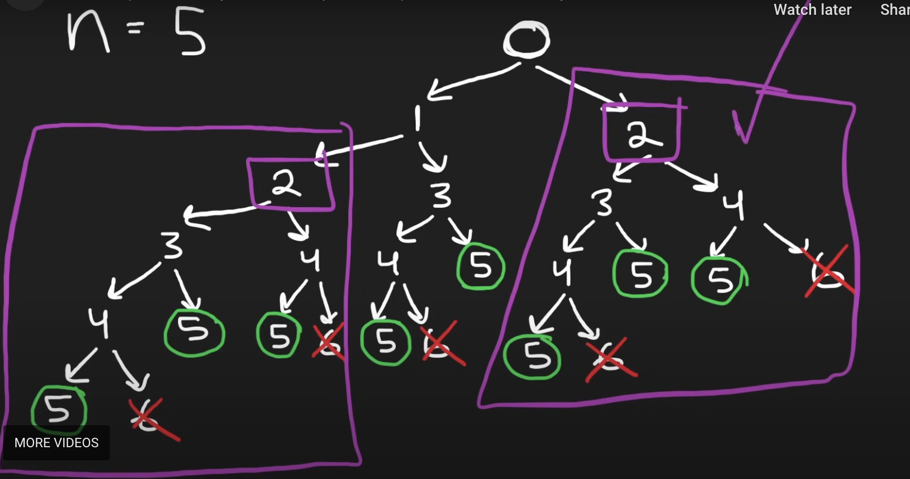
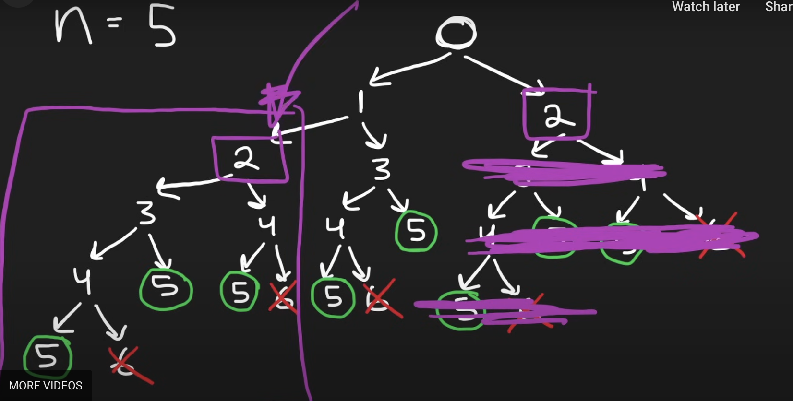
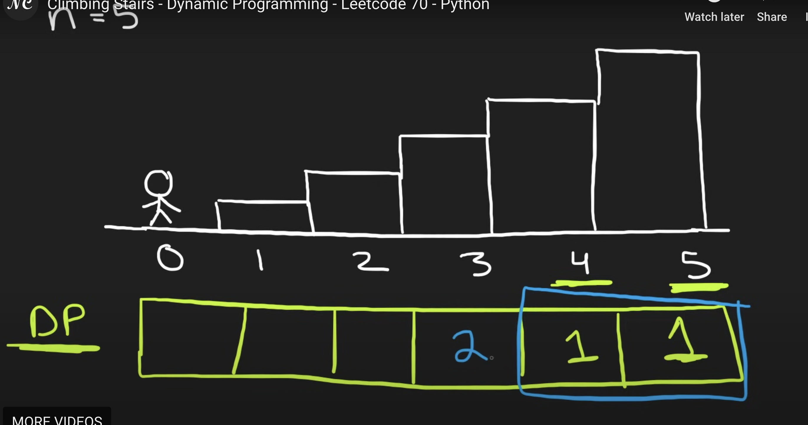
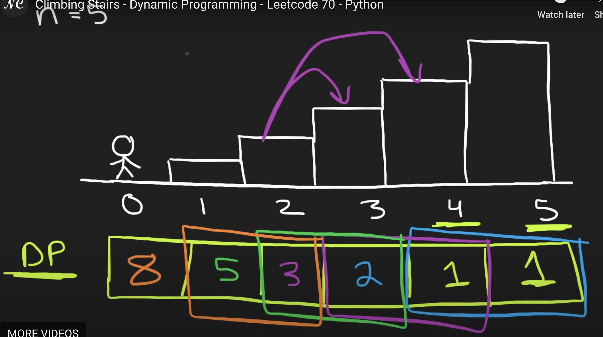

🌟🌟🌟🌟🌟 Must Read [climbing stair](https://github.com/purepisces/Wenqing-LeetcodeSolution/blob/main/1-D-Dynamic-Programming/Easy-70-Climbing-Stairs.md), which illustrate this dp concept excellent! 

```python
class Solution(object):
    def climbStairs(self, n):
        """
        :type n: int
        :rtype: int
        """
        # 0  1  2  3  4  5
        #            one two
        one, two = 1, 1
        for i in range(n-1):
            temp = one
            one = one + two
            two = temp
        return one
```

**caching:** My inituition here is that if the subproblem is same, we can just use a cache to store it, so we don't need to calculate it again. Not using dfs in decision tree, but elimate similar trees to avoid repeat work.So we know the first subproblem, the original problem is starting at 0, then we get a subproblem of 1, 2, 3,4 all the way to 5 which is our base case. So each of these sub problems is just being solved once and n is 5, so overall the time complexity is O(n). And this is **basically the dynamic programming solution where we are caching the result aka memorization.** **reading climbing stairs.md** 

 

**Bottom up dynamic programming.**: why don't we start at the bottom solve the base case and then work our way up to the original problem at 0? This is called a **bottom up dynamic programming.** Start at the base case, and work our way up. **reading climbing stairs.md** 

 

___
