```python
class Solution(object):
    def minCostClimbingStairs(self, cost):
        """
        :type cost: List[int]
        :rtype: int
        """
        # [10,15,20] 0
        # Have another extra 0 at the end of the array to make the math work out easily
        cost.append(0)
        for i in range(len(cost)-3,-1,-1):
            cost[i] = min(cost[i] + cost[i+1], cost[i] + cost[i+2])
        return min(cost[0],cost[1])
```
Time Complexity: O(n)
Space Complexity: O(1)

In this array every single index represents the entire cost it would take from this index to reach the end of the array or the top of the staircase. And if you start from index0, you need to pay the cost in index0 to reach the next index.

>-   The **time complexity** is O(n) due to the linear iteration over the list.
>-   The **space complexity** is O(1) because no extra space is used; the input list is modified in place.
___
___

Explanation:

Example:

cost = [10,15,20]

The last position in our cost array is not the top floor, the position right after that is considered the top floor. So in this example, the output is 15, not 10. And if you start at 10, you will need to pay 10. Then from here, you can either make one step to reach 15 or make two steps to reach 20. In this case, if start at 15, then take 2 steps will land us at the top of the startcase, will cost us 15. If start at 10, and take a jump of 2, and then take a jump of 1 will cost us 10 + 20 = 30. If start at 10, and jump one to reach 15, then jump 2 to reach the floor, will cost us 10 + 15 = 25. So the minimum cost is 15.

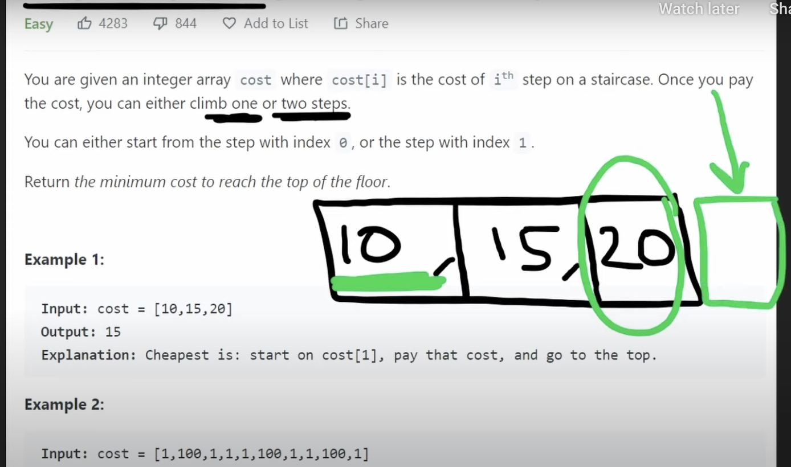

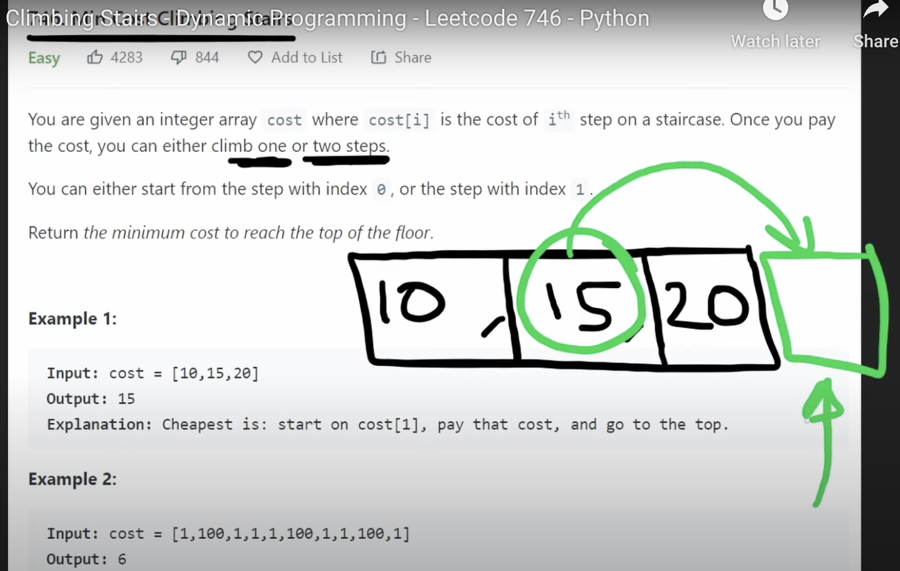

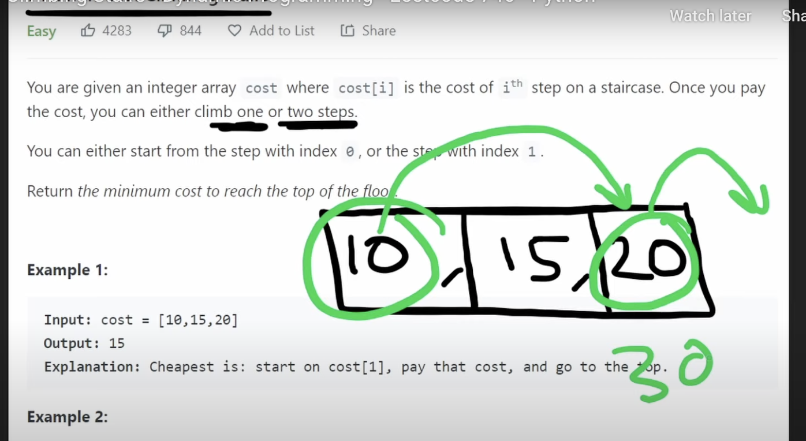

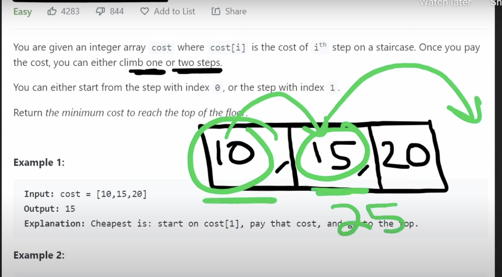

___
Firstly, try brute force solution. From every spot, we have two decisions, take a jump of one or take a jump of two. We can't just be greedy and take a two jump every single time(consider 1 5 10000 2 9]).  So let's try every single possibility. We like to do decision trees when we're brute forcing.
```python
#     [10 15 20]
# index 0  1  2  3
```
Index 3 is out of bounds which represents when we've reached the goal and we can stop. 

index 0 decision tree: So suppose we start at index 0, and we can either jump to index 1 or index2, and the cost for jump to index 1 will be 10, the cost for jump to index2 will also be 10. **Since if you start from index0, you need to pay the cost in index0 to reach the next index.** Then same process we can get the whole decison tree. Note that when start from index2, it make no sense if we take two jump, since index 4 is not our goal, we just need to reach index 3. So I remove this branch. From Index 3, we can not go any farther, which means we will stop at index 3. Finally, we can see there were 3 different ways for us to reach the goal, and among all of these, the minimum was 25.


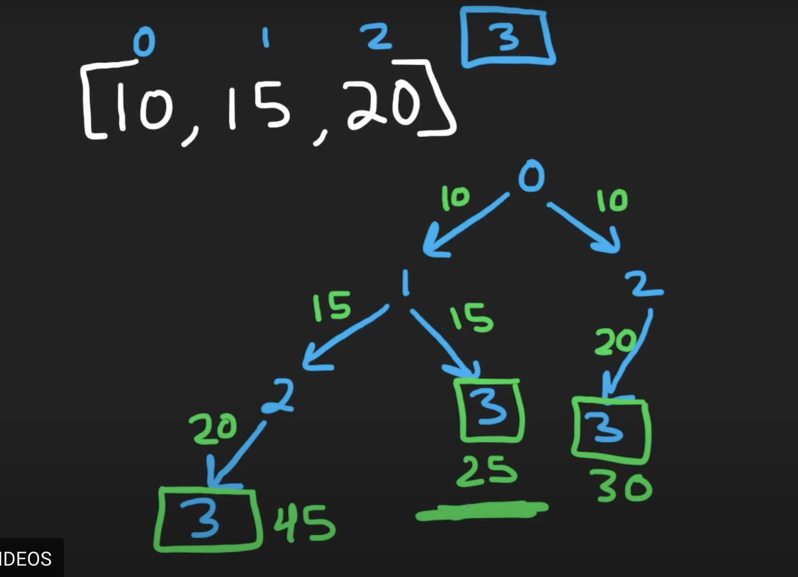

index 1 decision tree: suppose we start at index 1, we can see that we don't need to draw a decision tree for it, since it already exists in the index 0 decision tree. We just need to modify the numbers a tiny bit since when we start from index 1 the cost so far is not 10 it's actually 0, because we're pretending like we actually start from index 1. The main point here is there's repeat work here if we build a new decision tree starting from index 1. 


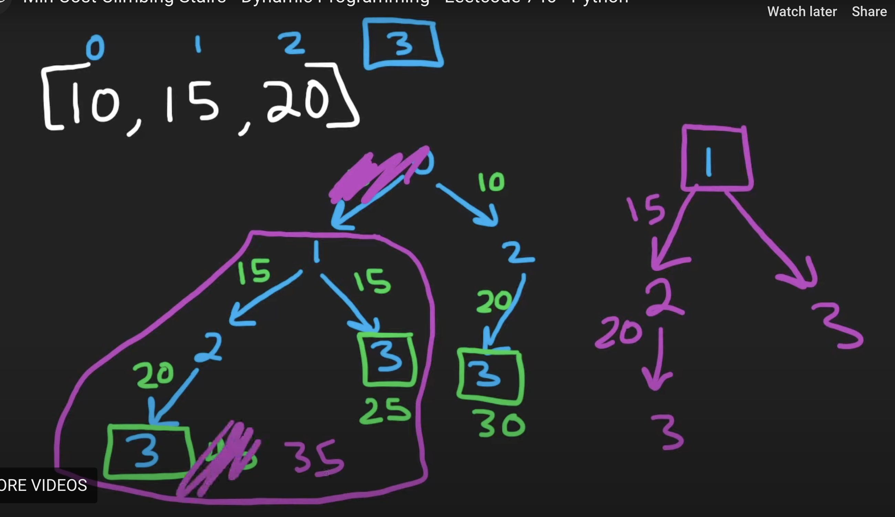

And If we take this solution as it is, it will be exponential because it's a decision tree. Each node is going to have two branches and we're keep doing that until we get to the base case which is index3. The max height of this tree is n, which equals to the length of cost array and we could have two branches for every single nodes so the time complexity is O($2^n$).

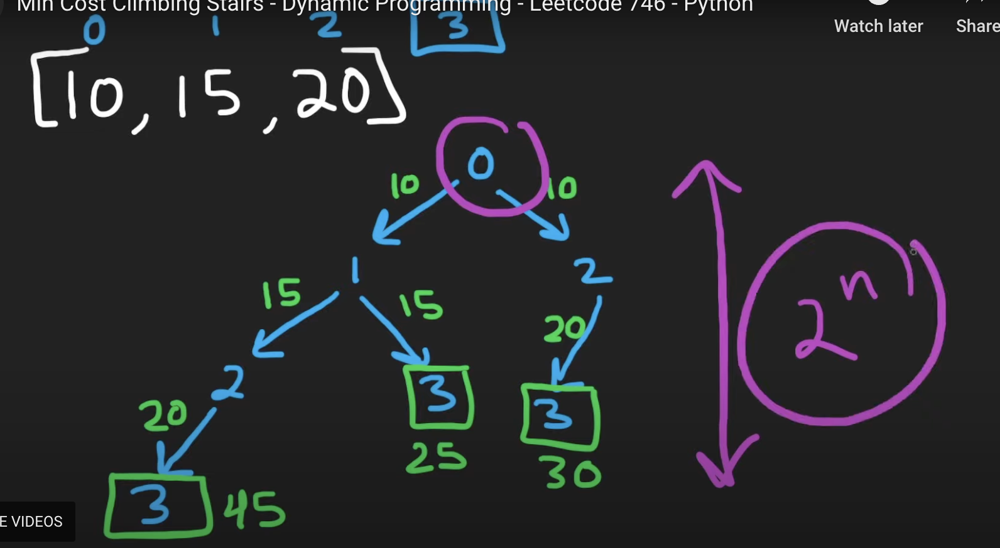
___
🌟🌟🌟However, there are lot of repeated work, if we eliminate the repeated work we can get the time complexity down to O(n). Since the original problem is what's the minimum cost if we start at index 0 to reach index 3, to solve this problem, we're asking a couple more questions. We're basically solving the subproblem. To solve the original problem, we have to first figure out if we're starting at index 1 what's the minimum cost of reaching index3. To solve if we're starting at index 1 what's the minimum cost of reaching index3, we need to ask another subproblem which is if we're starting at index 2 what's the minimum cost of reaching index3. 

🌟🌟🌟So if we cache this repeated work with a hashmap or something, so we don't repeat the same problem. For example from index 2 to get to index3, it will cost 20. So when we're trying to solve that same subprobem in the right portion, we don't have to run through that since we already solved it in left portion.

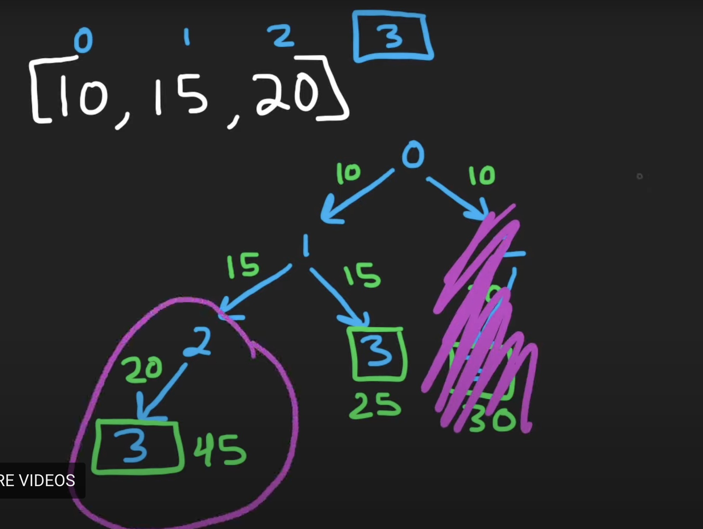


🌟🌟🌟🌟🌟 So that's the main idea of how we can get this to O(n), the reason is O(n) is because we have n subproblems. We're asking from index 0, how cost does it take to get to index3; from index 1, how cost does it take to get to index3; from index 2, how cost does it take to get to index3. That will be O(1) operation for each position in the array, which will be O(n) time complexiy and also be O(n) memory complexity. If we take this idea of caching, the recursive solution we can actually get an iterative solution.

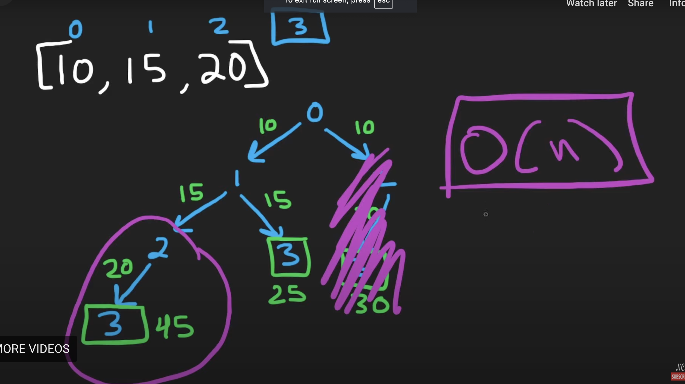
___

In this problem, we can have a slightly better memory complexity since we can actually use the input array itself that were given. And we could even just use two single variables to do the dp solution.

Every one of these cells has the dependency. For example, to solve the original problem starting at index 0 what's the minimum cost to reach index3, we first have to solve the subproblem of starting from 1 and start from 2.


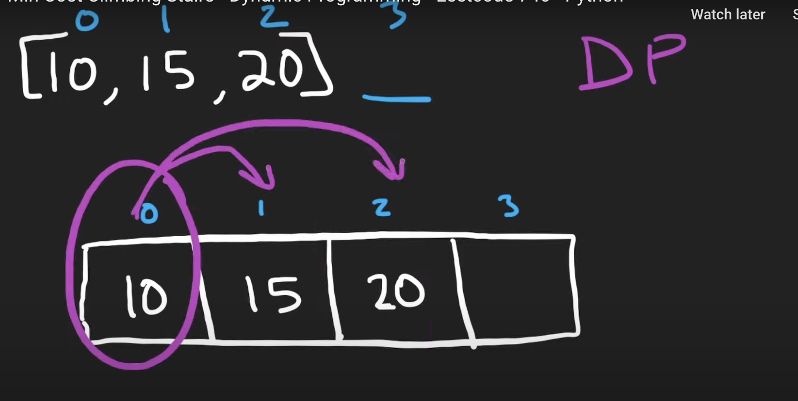
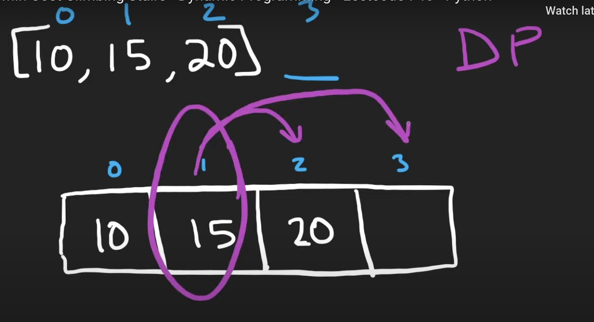
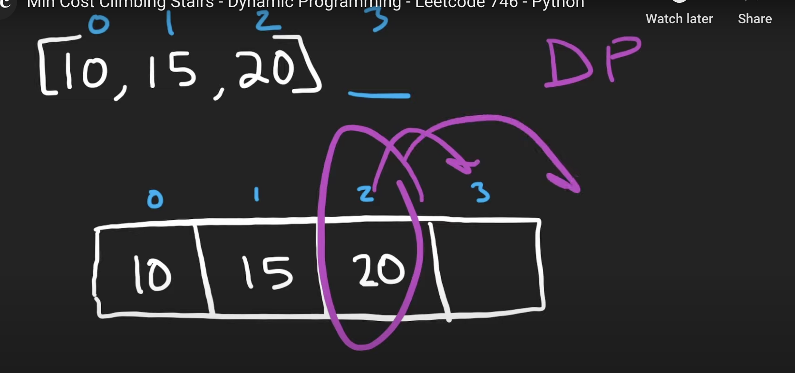


🌟🌟🌟🌟🌟 **So how about solve this problem from right to left rather than from left to right? Let's solve the sub problems first and then solve the original problem.**

**To make the math work out, we can put 0 to index3 which helps to do the calculation.** Since from index1 to index3, when it take one step reach index2, it will cost 15, then it should add the cost which from index 2 to reach index 3 which is 20, the total is 15+20 = 35; when it take two steps reach index3, it will cost 15, then it should add the cost which from index 3 to reach index3, we can manully set it to be 0 which help us to calculate, the total is 15+0 = 15. So there are two possibilities, one is take a single jump to index2 and then go to index3, which cost is 15+20 = 35; the other is do a double jump to reach index3, which cost is 15+0 = 15. We will take the minimum of these two, which is min(15+20, 15+0) = 15.


Similarly, for index 0, if take one step reach index 1, and the cost for index1 to reach index3 is 15, then 10+15 = 25; if take two step reach index2, and the cost for index2 to reach index3 is 20, then 10+20 = 30. Minimum cost is min(25,30) = 25.

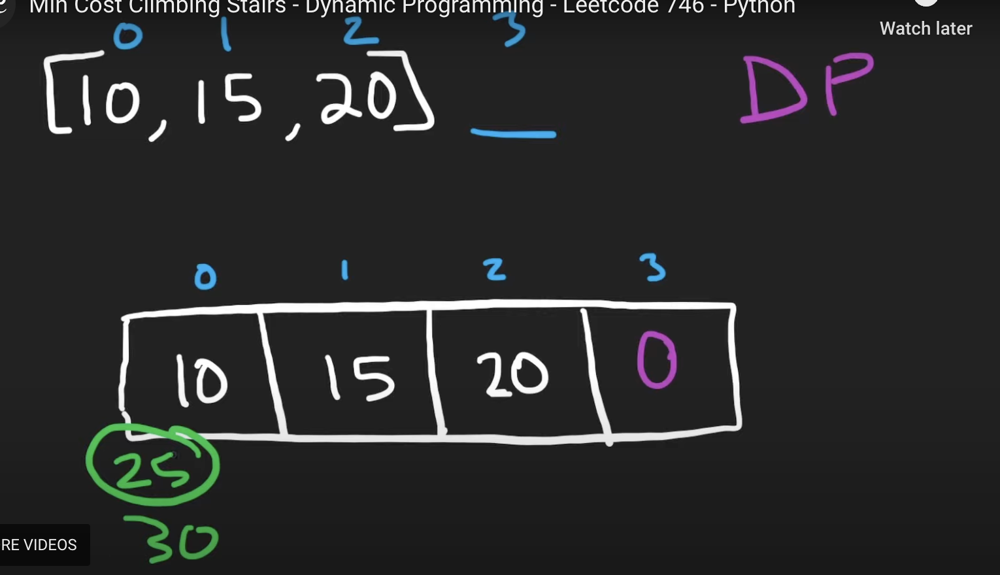

🌟🌟🌟🌟🌟Now **in this array every single index represents the entire cost it would take from this index to reach the end of the array or the top of the staircase.** From index2, it will be 20, from index1, it will be 15, from index 0, it will be 25. So we are gonna **return the minimum of the first two values in this array**, since we can start at index0 or index1. min(25,15) = 15, so we return 15.


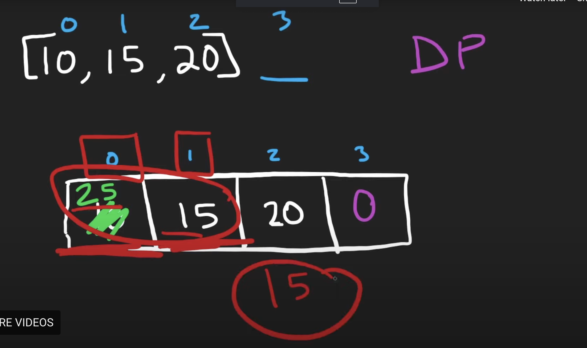

The time complexity is O(n) since we are iterating through the array in reverse and the memory complexity is O(1) since we just use the input array itself. 

> Or we could not modify the input array, just use two variables like the question climbing stairs do. 

```python
class Solution(object):
    def minCostClimbingStairs(self, cost):
        """
        :type cost: List[int]
        :rtype: int
        """
        # [10,15,20] 0
        # Have another extra 0 at the end of the array to make the math work out easily
        cost.append(0)
        for i in range(len(cost)-3,-1,-1):
            cost[i] = min(cost[i] + cost[i+1], cost[i] + cost[i+2])
        return min(cost[0],cost[1])
```


### Why Does Index 0 Depend on the Subproblem from Index 1?

The key idea is that **to climb the staircase, you can only move forward by either one or two steps**. From index 0, you have two possible ways to proceed:

1.  Take **one step** to reach index 1, then continue climbing from index 1 to the top (index 3).
2.  Take **two steps** to reach index 2, then continue climbing from index 2 to the top (index 3).

Thus, the total cost of starting from index 0 is directly dependent on:

-   The cost of starting from index 1 and solving the subproblem for "minimum cost to reach index 3 from index 1".
-   The cost of starting from index 2 and solving the subproblem for "minimum cost to reach index 3 from index 2".
___
___
