```python
class Solution(object):
    def wordBreak(self, s, wordDict):
        """
        :type s: str
        :type wordDict: List[str]
        :rtype: bool
        """
        dp = [False] * (len(s) + 1)
        dp[len(s)] = True
        for i in range(len(s)-1, -1, -1):
            for word in wordDict:
                if (i + len(word))  <= len(s) and s[i : i + len(word)] == word:
                    dp[i] = dp[i + len(word)]
                if dp[i]:
                    break
        return dp[0]
```
Time complexity: O(n∗m∗t)

Space Complexity: O(n)


>  **Time Complexity:** $O(n \cdot m \cdot t)$ — Depends on the input string's length, the number of words in the dictionary, and the average word length.

___
___
Explanation:

Let's start with the brute force solutoin. One thing we could try for an input string like "leetcode", we could check the first character "l", if it in our word dictionary ["leet","code"], it's not. Then try "le", then try"lee", we would try every single portion from the beginning until we found a matching word that exist in our word dictionary. Then we find that "leet" exist in worddict.

What should we do next? Clearly we have a subproblem, we found a matching word for "leet" portion, now we want to know can we break up the rest of this string(which is "code") with words from our dictionary. 

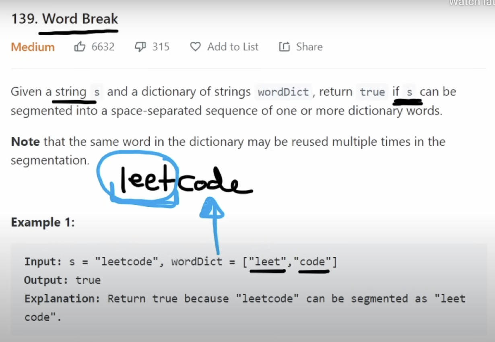


So instead of starting from the first position"l" in the string, we would start at "c" and try to word break it.

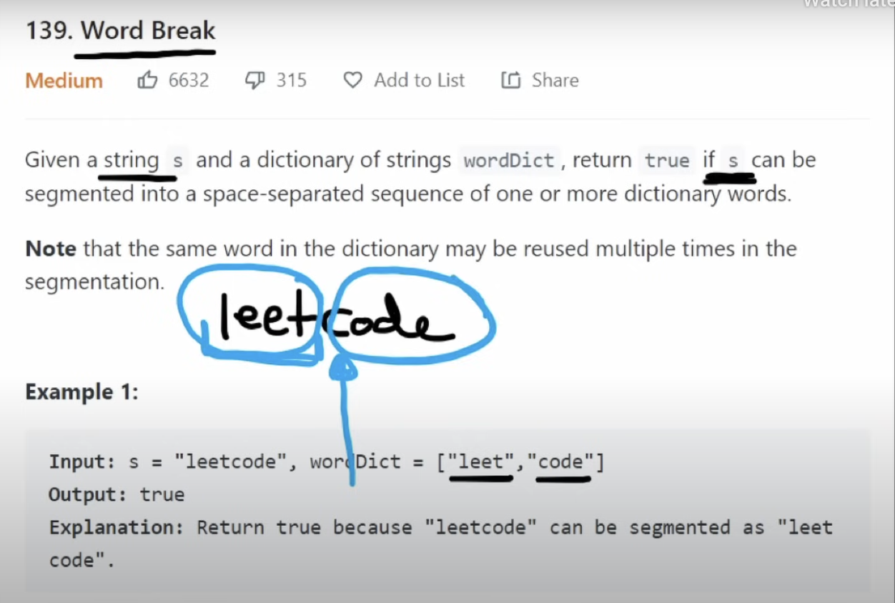

In this approach, from every single starting position we're going to check every prefix,  so from the first starting position, then if first position is in worddict, we will then start from second position and check every word starting here.


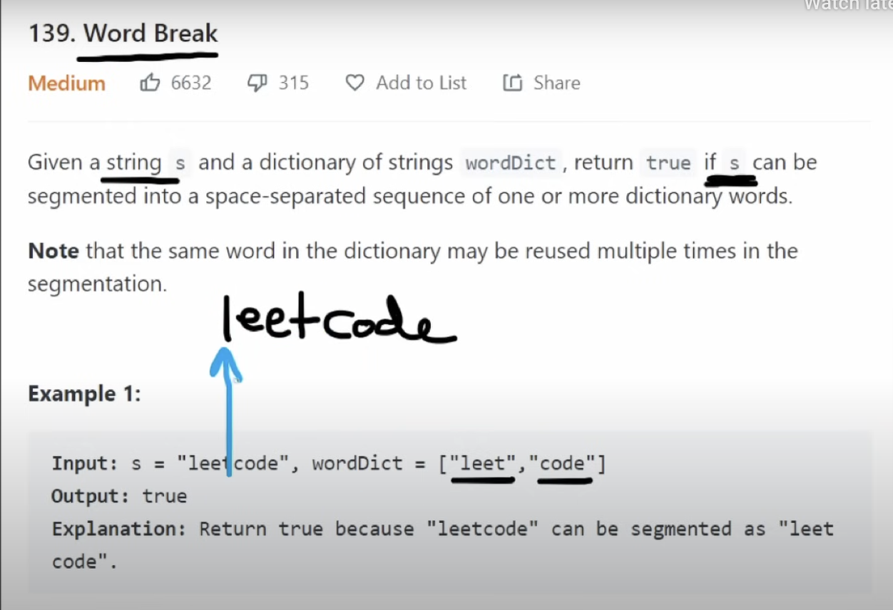

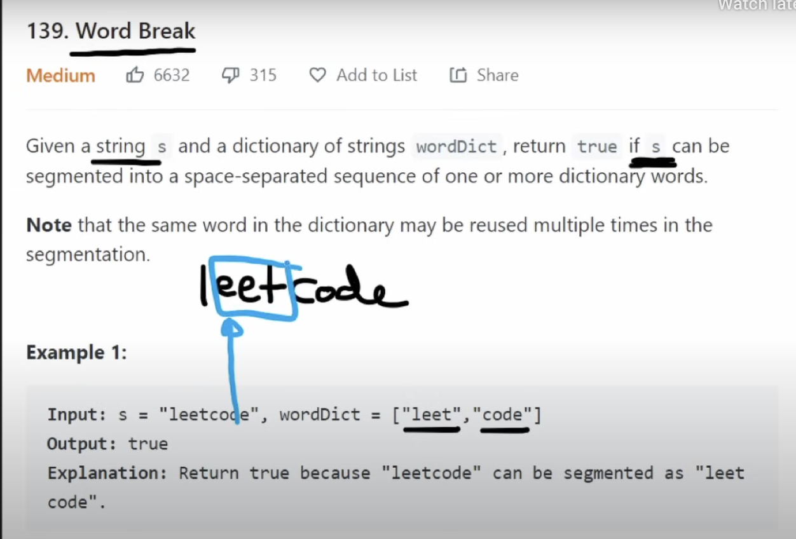

So basically we're try every word. How many different words are we going to end up trying?  $O(n^2)$.
___

We can also do it in a different way. For string = "leetcode" and wordDict = ["leet", "code"]. Instead of trying every single possible prefix, let's just check every word in our word dictionary and see if that matches. For example, this first word is 4 characters long, so what we're going to do is we're going to check the first 4 characters in our string which is "leet" , and check if it match the word "leet" in word dict.

So instead of checking every single possible prefix of any length, we're going to check every single word in our word dictionary as the prefix. So the time complexity is O(n*m*n) because we are going to going through every single starting position in string s but we are going to multiplying by the number of words in our word dictionary, which is m. And when we're checking for example if the worddict "leet" is matching the string "leet", that's also a n time operation, because potentially be the size of the input string s.

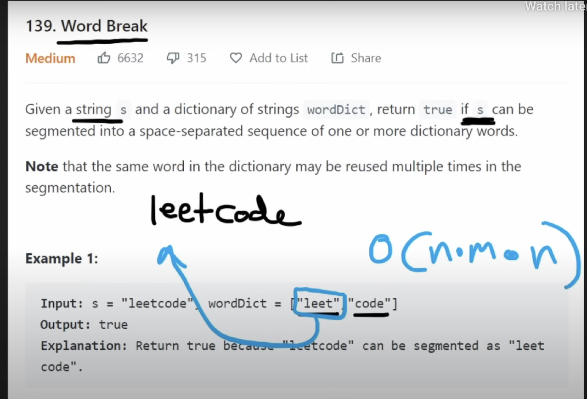
___
🌟🌟🌟🌟🌟🌟🌟🌟🌟**Firstly, I will give a quick illustration of what the decision tree would look like then we're going to understand how we could cache that to eliminate repeated work and then by understanding that, we're going to the optimal dynamic programming solution: the bottom up approach.** And usually dp solution is a lot less code than caching.

We're going to look at our input string s = "neetcode", and wordDict = ["neet", "leet", "code"]. What will the decision tree is gonna to be? We are going to start at the first position, i = 0, we're gonna be keeping track of whatever index we're. since If we can find a word that matches neet then the subproblem is gonna be finding words that can match the remainder of the string.  So next i would starting at index 4, that's what the subproblem is going to be. So really we're only going to have one variable that we're keeping track of in this backtracking solution.

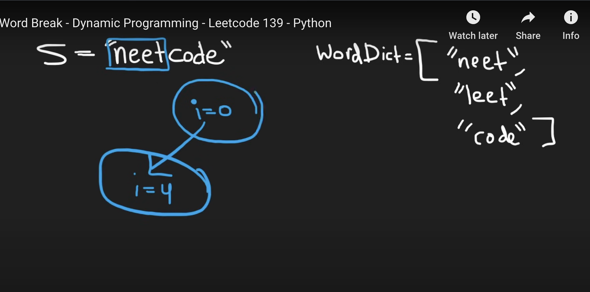

So remember we mentioned we're not going to be doing like this, we're not going to check every single prefix such as "n", "ne". Instead, we're going to have decisions in our decision tree based on the number of words that are in the word dictionary. So we're going to have a decision for "neet", a decision for "leet", and a decision for "code".

Now we check if neet match the first four character, yes, if "leet" match the fist four character, no; if code match the first four character, no. So we're continue on "neet" path, we're gonna do three more decisions which is for every single word in our wordDict. Also from i = 0, we update to i=4, and then since "code" match "code" in wordDict, then update to i = 8. Since 8 is the position right after the end of the string, therefore we know we are able to match the entire string, thus we can return true. Once we find a single true, we can just terminate and return true and the funtion is done.

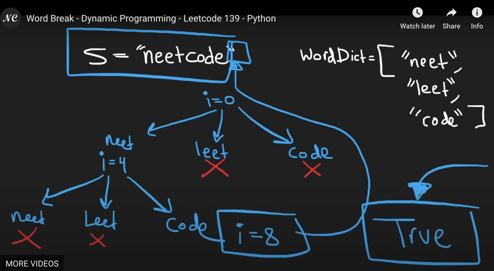

And why we need to cache it? Since assume we reach index = 5 and the result is false, then next time through different path when we reach index = 5, we don't want to recalculate it. Just use the result we calculated before, that's why we need to cache it.

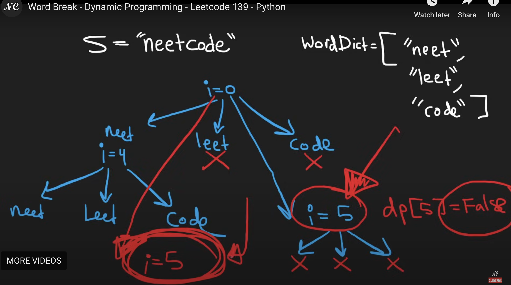
___
For string  s = "neetcode", and wordDict = ["neet", "leet", "code"]

So we discovered our base case is dp[8] since 8 is the length of the string and is going to be true. **dp[8] = True since if we can ever get to the last index, we're going to return True.** Now do the bottom up approach, we're going to go through every single index in reverse order. We would start at the last character which is position 7, and see can we word break the remainder of this string, and we would try every single word: does "neet" match "e"? They're not even te same size. Since "e" not match to any word in wordDict, dp[7] will be false.

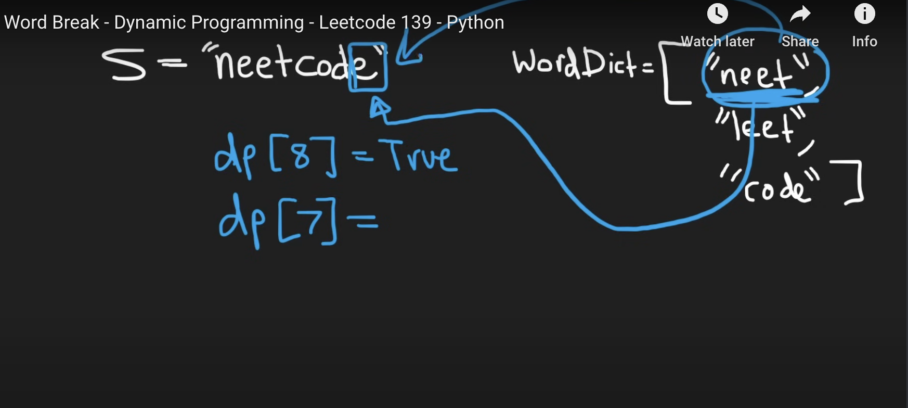

That will also be False for dp[6] and dp[5] for dp[5] "ode" doesn't match any of the word in wordDict.

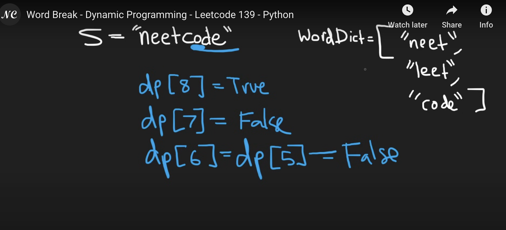

But now if we start index 4, dp[4] = True, since it match "code" in wordDict although it doesn't match "neet" and "leet" in wordDict. 

dp[3] is False, since 'tcod" no word in wordDict start with a t. dp[2] is also false, since "etco" doesn't match any word, dp[1] is also false since "eetc" doesn't match any word in wordDict.

Now for dp[0], since the word "neet" in wordDict match the portion in string s which start at index 0. Then the question becomes can we break the entrie string starting at 0? Now since we did match the first four characters we want to know were we able to match the remainder of the string? We want to know, if we starting from index 4, which is character "c", were we able to match this string "code" to words in our word dictionary? So this is why we compute this bottom up. And this is index4, we already computed dp[4] = True. So **the equation is dp[0] = dp[0 + len(word)], where len(word) is the word we are able to match with.** Since "neet" is length 4, so dp[0] = dp[0 + 4] = dp[4] = True. Finally, we can return true for the overall function.

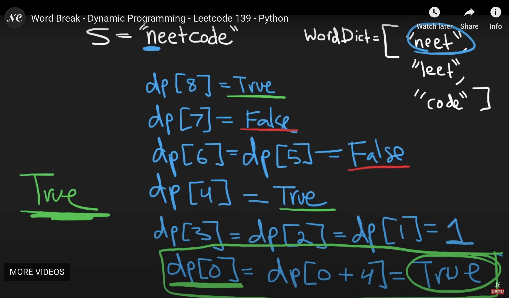

___

Let's write the code! The cache is going to 1-dimensional array because for every position i in the string s we are going to have a value. We're going to initialize it to false, it's going to be the length of the string s +1.
```python
dp = [False] * (len(s)+1)
```
And we are going to initialize our **base case**: the position out of bounds of the string to be True.

```python
dp[len(s)] = True
```

🌟🌟🌟🌟🌟 **Now go through every position i in the length of the string starting at the last index and working our way to the beginning.  For each position i, we want to try every single word in our word dictionary and see if the word matches this portion. So first we have to see if starting at position i, the string s even has enough characters for w to be compared with.  So we will first check (i+len(w)) <= len(s), if that's the case, it will mean there are enough characters in s for us to compare them. If true, then let's compare, which is s[i:i+len(w)] == w. So dp[i] is going to be set to dp[i] = dp[i+len(w)]. That's the relationship we got, i + len(w). If we got a single way to word break this starting at index i, then basically we can stop the loop "for w in wordDict", we don't have to look at every single word in the dictionary if we found at least one way we were able to word break it, then we're gonna stop. So if dp[i] is true, we can break out of this for loop and then move on to the next index. Finaly, we can return it, and that's going to be store in dp[0]**

```python
class Solution(object):
    def wordBreak(self, s, wordDict):
        """
        :type s: str
        :type wordDict: List[str]
        :rtype: bool
        """
        dp = [False] * (len(s) + 1)
        dp[len(s)] = True
        for i in range(len(s)-1, -1, -1):
            for word in wordDict:
                if (i + len(word))  <= len(s) and s[i : i + len(word)] == word:
                    dp[i] = dp[i + len(word)]
                if dp[i]:
                    break
        return dp[0]
```
Time complexity: O(n∗m∗t)

Space Complexity: O(n)


>  **Time Complexity:** $O(n \cdot m \cdot t)$ — Depends on the input string's length, the number of words in the dictionary, and the average word length.
___
___

