```python
class Solution(object):
    def maxProduct(self, nums):
        """
        :type nums: List[int]
        :rtype: int
        """
        res = max(nums)
        curMin, curMax = 1, 1 # neutral value
        # curMax: maximum product ending at the current element.
        # curMin: minimum product ending at the current element.
        for n in nums:
            tmp = curMax * n
            curMax = max(n * curMax, n * curMin, n) # [-1,8]
            curMin = min(tmp, n * curMin, n)
            res = max(res, curMax)
        return res
```
Time complexity: O(n)

Space Complexity: O(1)

We store the current maximum and current minimum of the subarray we encounted so far. For example [1,2,-3,4] when n get to 4, we will have the curMax product of subarray[1,2,-3] and curMin product of subarray[1,2,-3], which is a dp problem.

___
___
Explanation:

This is a dynamic programming problem.

Firstly let's try brute force solution, let's try every single subarray. For array [2, 3, -2, 4], if starting at 2, the subarray will be : [2], [2, 3], [2, 3, -2], [2, 3, -2, 4]. And for each of this, let's just calculate the product, the first one is 2, and the next one is 2*3, next is 2*3*-2, last is 2*3*-2*4. And so far the biggest is 2*3.

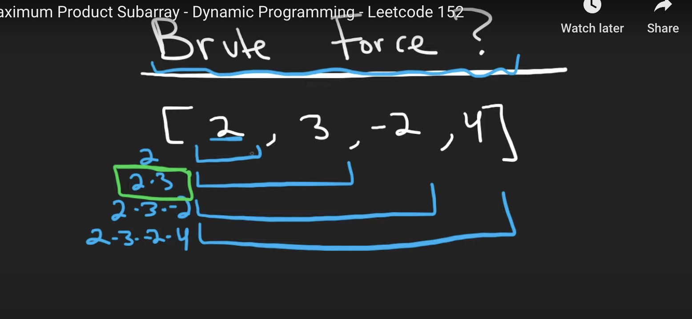

And we are techinically not done yer since all of these subarrays contain 2. Now let's look at all subarrays contain 3, which will be [3],[3,-2],[3,-2,4]. And they are 3, 3*-2, 3*-2*4 separately.

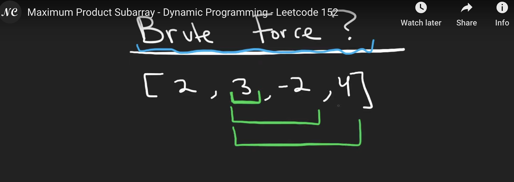

And we repeat this process. This is inefficient and the time complexity is O($n^2$). Since for each of these numbers we're going to end up having n subarrays, and the total number of elements is also n. So $n*n = n^2$.
___
let's do better! Maybe there are some patterns in this problem.

Example 1:
[1,2,3, 4,5] all elements are positive, product increasing

Until first point our product is 1, until second point our product is 2. until third point our product is 6, then 24, then 120. If we have positive numbers, the product will keep increasing, we can just multiply all of them and get the max product.

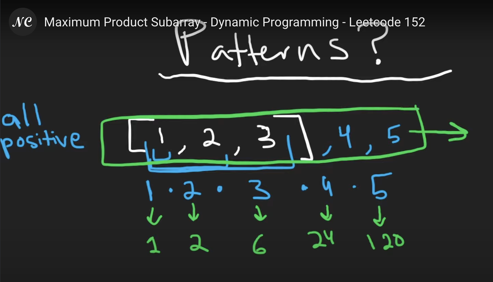

Example 1:

[-1, -2, -3] all elements are negative

[-1, -2, -3, -4, -5] for subarray contain -1, the product is -1, 2, -6, 24, -120. The sign is alternating, so when you want the maximum, it is triky.

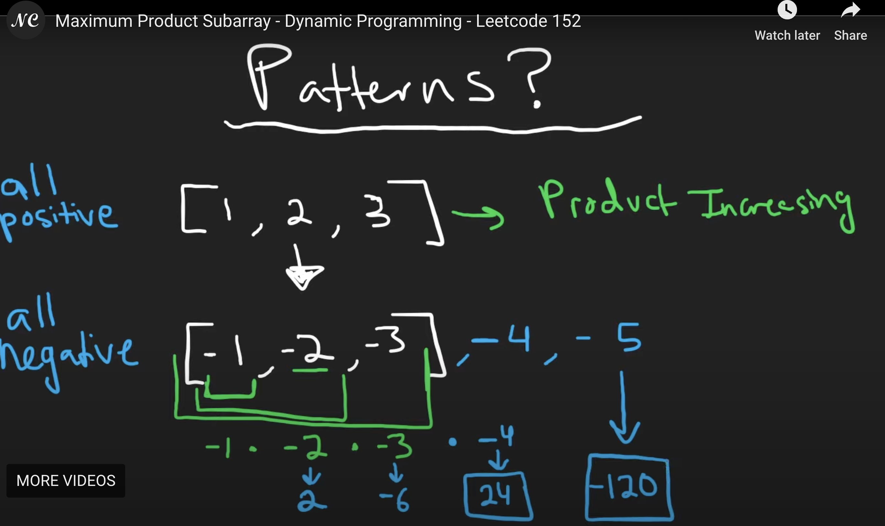

🌟🌟🌟🌟🌟 But we also see that even though we got -6 at third point which is subarray[-1,-2,-3] and product -1*-2*-3 = -6, there's a subarray which doesn't contain -1, [-2,-3], the product will be -2*-3 = 6. So why did we get a -6 not 6, how can we find the real maximum which is 6 not -6?

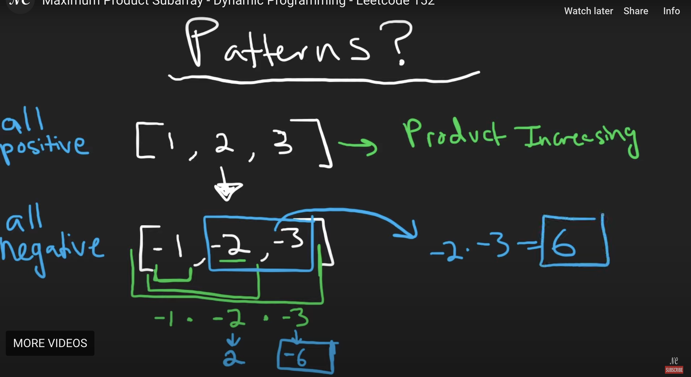

🌟🌟🌟🌟🌟 So **even though we are looking for the max product subarray, we're also need to keep track of the minimum as well.**

Let me explain it. Firstly, if we want to find the max product subarray of the entire array [-1,-2,-3], it might be helpful to solve the subproblem which is the max product subarray of [-1,-2], then use that to get the entire one. 

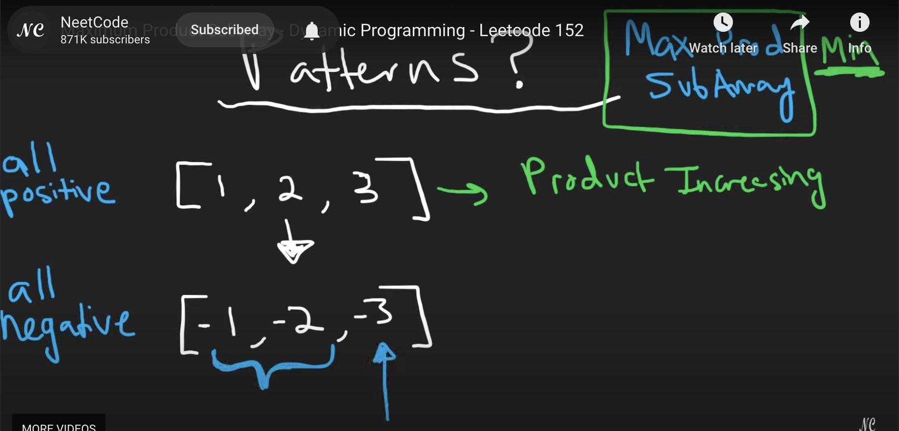

🌟🌟🌟🌟🌟 And we know the max product subarray of [-1,-2] is 2, then our entire array is [-1, -2, 3] then we directly multiply 2 with 3, which is 2*3 = 6. It works for positive numbers. However, for negative numbers that the entire array is [-1, -2, -3] , it is not the case. So we need also store the minimum product of subarray[-1,-2] which is -2. So max product subarray of [-1,-2] is 2, and  min product of subarray[-1,-2]  is -2. We need to keep track of both positive and negative, **we keep the max  and the minimum.**

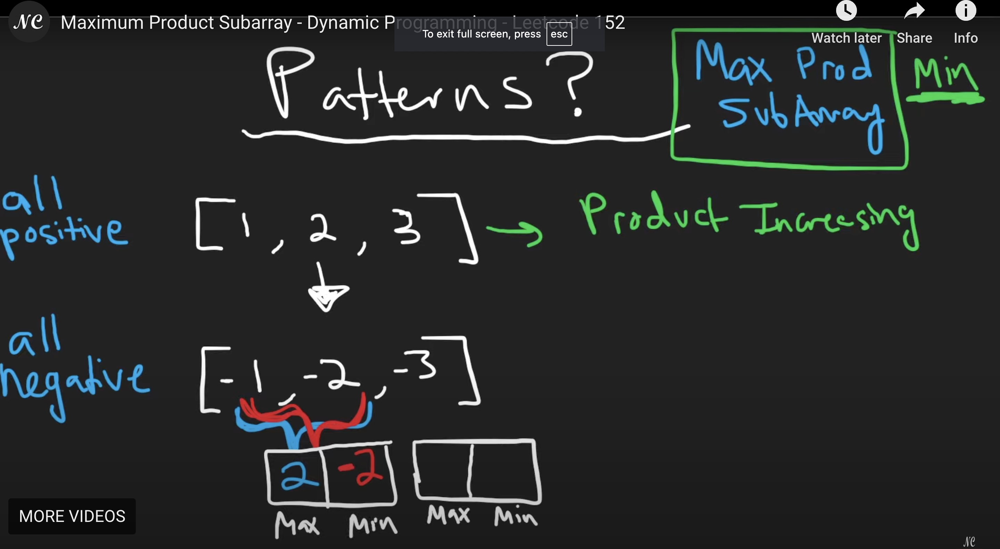

Now we want to compute the max product subarray when we include -3, then we can compute using both of the previous max and min values which is 2 and -2 separetely. When we take the max 2, we get -3*2 = -6; and when we take the min -2, we get -3 * -2 = 6. Now we know the max is 6, and min is -6 so far.

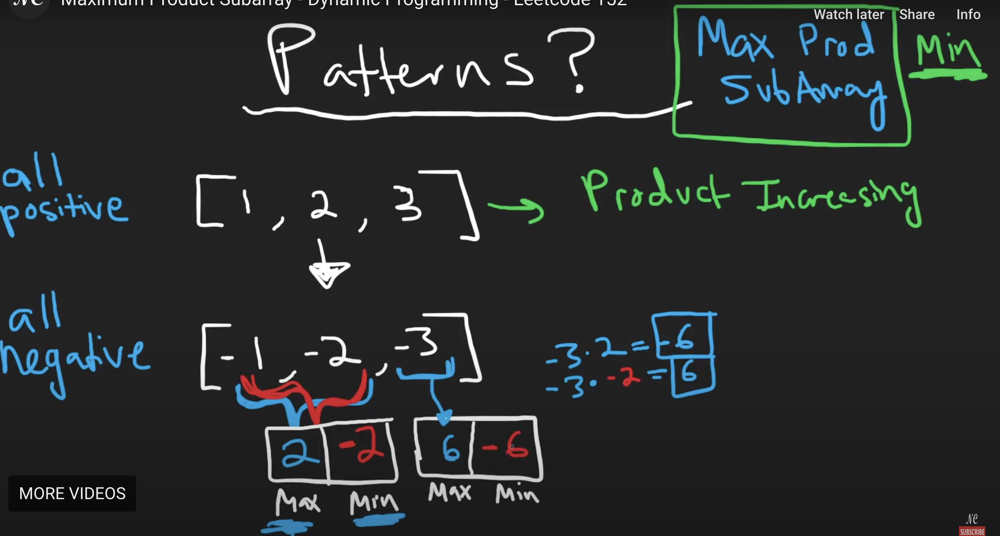

If I append -4 in the entire array, then max will be -4*-6 = 24; If I append 4 in the entire array, then max will be 4*6 = 24. **Therefore, if we mantain max and min, we will have all the information we need as we continue to add more elements to our entire array.**

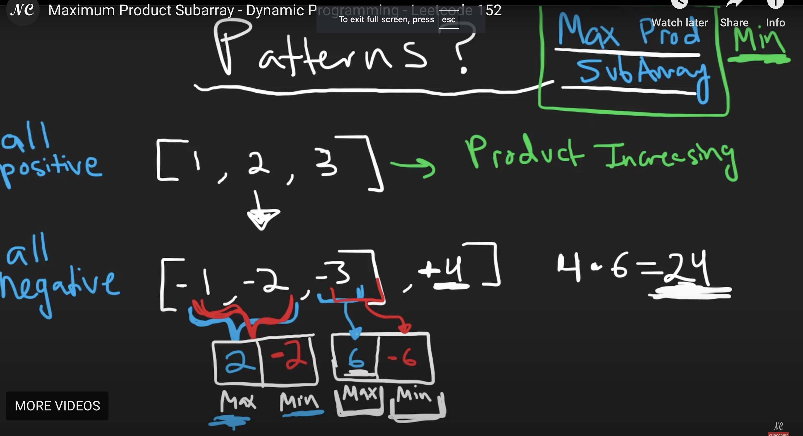

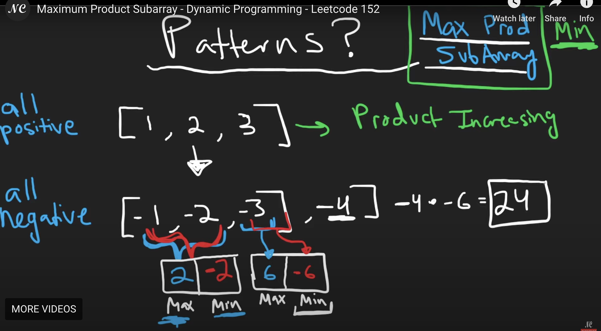

___
Now let's look at one edge case: entrie array contain value 0. (Note when we actually coding it, we don't ned to consider handle 0 part since it will be handled in another way.)

[-1,-2,-3,0,3,5]

if we take 6* 0 = 0, -6*0 = 0, and after element 0, the product will reamin 0 for element 3, and element 5 since x*0 = 0. (x is any value).

🌟🌟🌟🌟🌟 So we can handle this in a different way, that anytime **when we get a 0 value, we can reset our max to 1 rather to 1, and also reset minimum to 1.** Because we don't want to kill the product, and element 0 in array will be igonred. If we set max and min to 1, then if we start introducing new value after it such like 3, it's just going to be 1 * 3 = 3. **1 is like a neutral value.** 

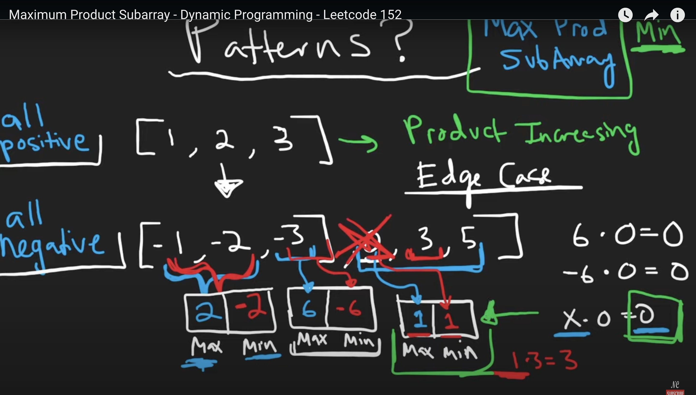

___
🌟🌟🌟🌟🌟🌟🌟🌟🌟🌟 **So the whole idea is to manitain the max and minimum of our product and we want to handle the 0 case by resetting everything to a neutral value like 1.**

```python
class Solution(object):
    def maxProduct(self, nums):
        """
        :type nums: List[int]
        :rtype: int
        """
        res = max(nums)
        curMin, curMax = 1, 1

        for n in nums:
            if n == 0: # can remove this case
                curMin, curMax = 1, 1
                continue
            tmp = curMax * n
            curMax = max(n * curMax, n * curMin, n)
            curMin = min(tmp, n * curMin, n)
            res = max(res, curMax)
        return res
```
`res = max(nums)`: we will not set res = 0, since consider nums = [-1], the max product will be smaller than 0.

`curMin, curMax = 1, 1`: set current min and current max to be 1, since 1 is neutral value.

`if n == 0:`: actually **we can remove this case**, since although the curMin, curMax will be 0, but in next line  curMax = max(n * curMax, n * curMin, n) and  curMin = min(tmp, n * curMin, n) will make it set back to n's value, no influence of 0.

**`curMax = max( n*curMax, n*curMin, n)` : Consider [-1,8], when went to 8, the max should be 8 itself, since n*curMax = 8*-1 = -8 and n*curMin = 8*-1 = -8 which is less then n = 8.**

We can consider it as dynamic programming problem since consider this example
```python
[1, 2, -3, 4]
#       n
```
🌟🌟🌟🌟🌟🌟🌟🌟When we get to n which points to value -3, we will have the current maximum product of subarray[1,2] and current minimum product of subarray[1,2].

🌟🌟🌟🌟🌟🌟🌟🌟And when our n gets shifted to the next value 4, we will have the current maximum product of subarray[1,2,-3] and current minimum product of subarray[1,2,-3].

```python
[1, 2, -3, 4]
#          n
```
And then by the time our n value is out of bounds, we will have the current max and the current minimum for the entire array computed.

```python
[1, 2, -3, 4]
#              n
```

**We store the current maximum and current minimum of the subarray we encounted so far. For example [1,2,-3,4] when n get to 4, we will have the curMax product of subarray[1,2,-3] and curMin product of subarray[1,2,-3], which is a dp problem.**

Time complexity: O(n)

Space complexity : O(1)
___
___
