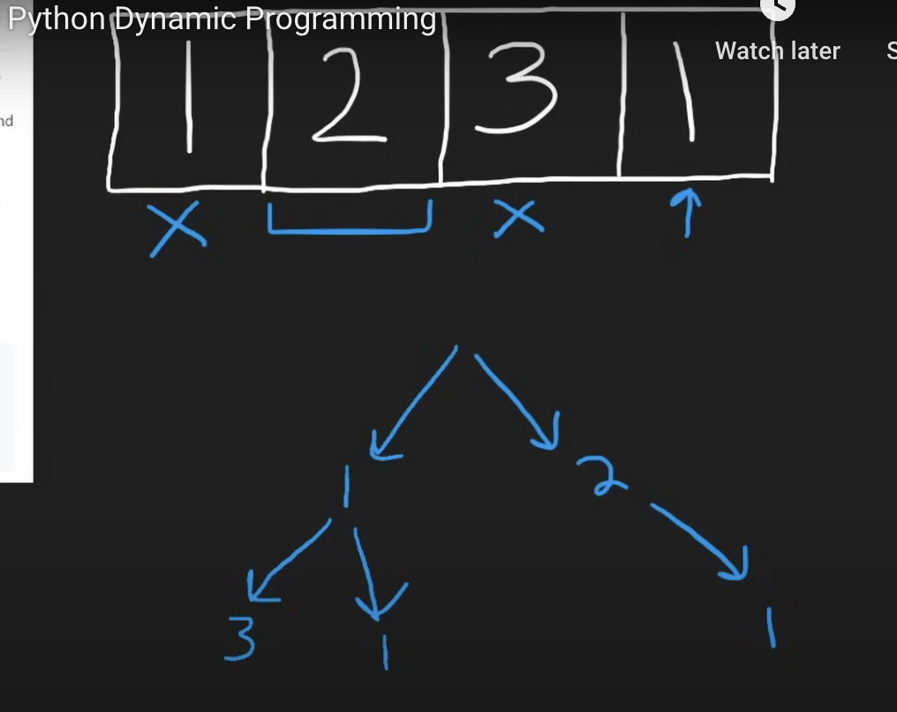
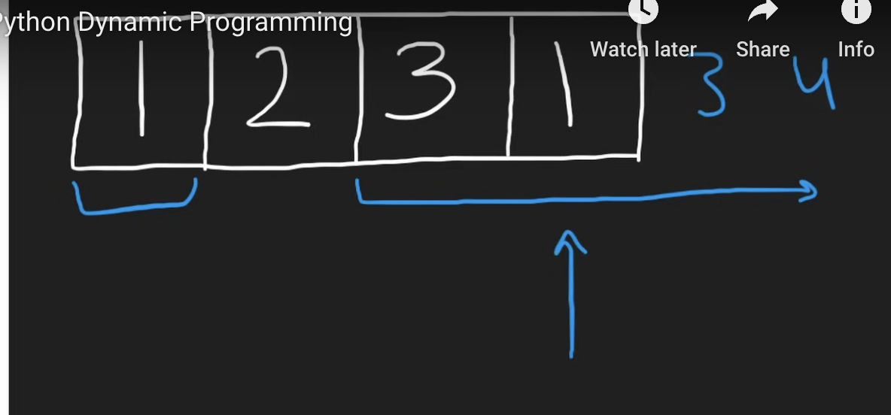
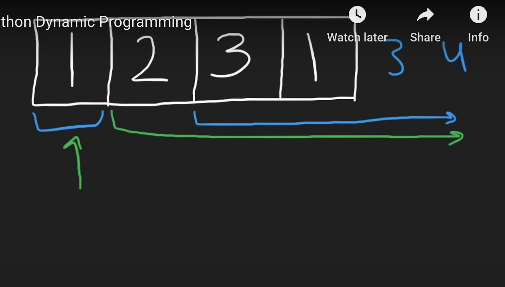
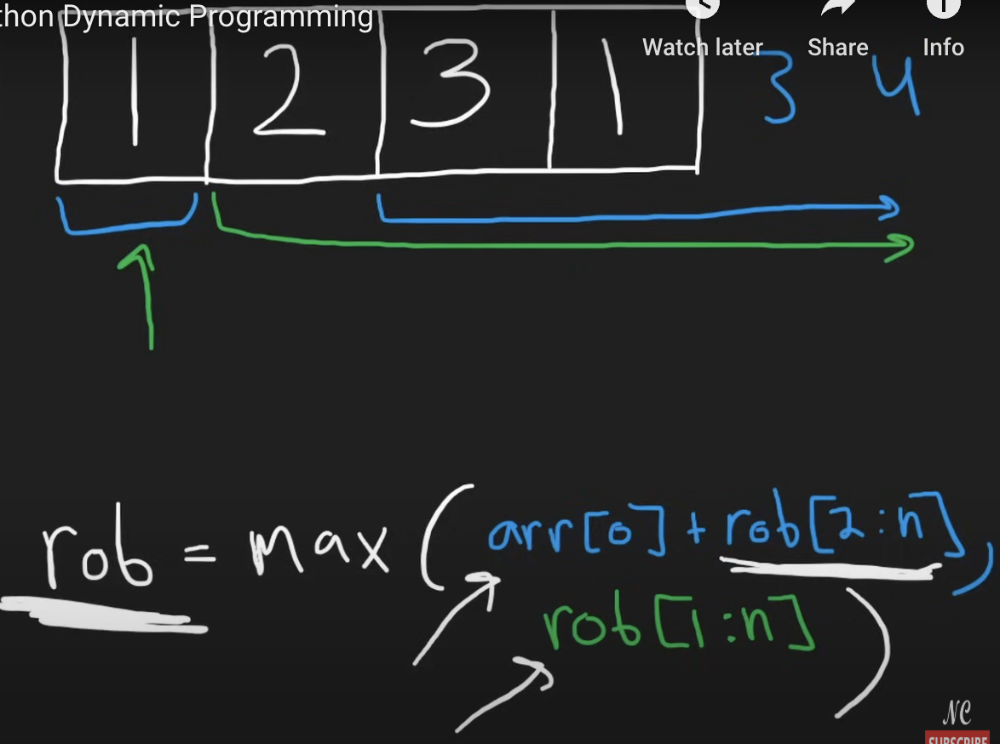
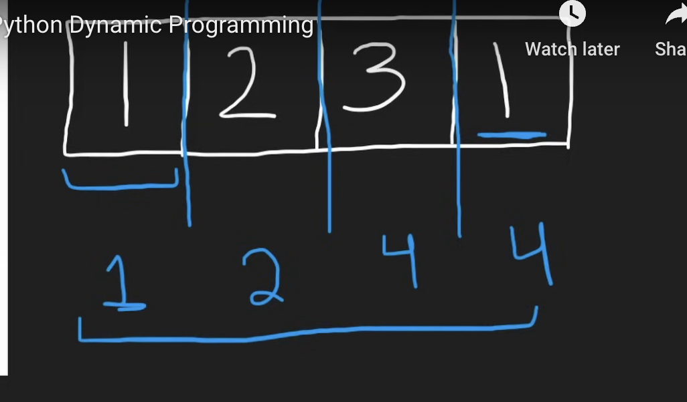
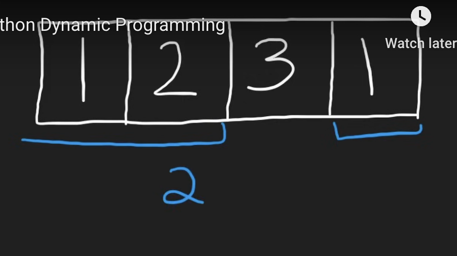
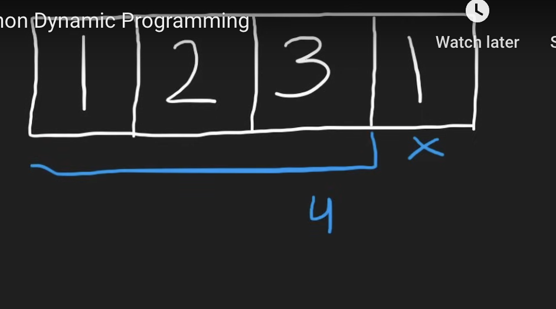

"rob" variable refers to the maximum amount of money you can rob when you reach a certain point (house).
```python
class Solution(object):
    def rob(self, nums):
        """
        :type nums: List[int]
        :rtype: int
        """
        rob1, rob2 = 0, 0
        # [rob1, rob2, n, n+1, ...]
        for n in nums:
            temp = max(n + rob1, rob2)
            rob1 = rob2
            rob2 = temp
        return rob2
```
Time Complexity: O(n)
Space Complexity: O(1)

Each rob represents what's the max amount we can rob up until this point, and rob2 is the last value that return.
___
___

Explanation:

Example:

[1,2,3,1]

Firstly for brute force approach, I will draw it in decision tree to demonstrate it.



That is very complex, so let's see if we can define the subproblem. So remember we have two choices and we want to get the max that we can rob from this entire array: [1,2,3,1]. So the first choice is we rob from the first house and then find the maximum from the remaining houses, imagine there are more houses here, [1,2,3,1,3,4...],  then **this is the subproblem: we're finding the max of a subarray of the entire array.** The second choice we have is we skip the first house,  and it means we need to find the maximum of the entire subarray not including the first value. See the green portion for second choice, and blue portion for first-choice.





Now let's write the relationship, if we want to find the max we can rob from the entire array, we have two choices: 

**rob = max(arr[0] + rob[2:n], rob[1:n])**

**where rob indicates the max that we can rob from the entire array.** And arr[0] + rob[2:n] is when we rob the first house, and the subproblem is rob[2:n], rob[1:] is when we skip the first house, and the subproblem is rob[1:]. This is the way to break up dynamic programming problems. The result of the entire problem depends on only these two: arr[0] + rob[2:n] and rob[1:n]. But notice each rob(e.g.rob[2:n]) can be broken up into its own sub-problem just like we did over here(rob = max(arr[0] + rob[2:n], rob[1:n])).



Let's actually solve the subproblem now before we solve the entire problem. Using in order not reverse order to solve it is more inituitive.

🌟🌟🌟🌟🌟**What's the max amount we can rob up until this point?** For example, [1,2,3,1], for first house, the value is 1, for second house, it can choose rob house1 and not rob house2 or choose not rob house1 and rob house2, so max(1,2) = 2. For third house, we can rob house3 and rob house1 or we can just rob house2, so max(1+3, 2) = 4. For the fourth house, we can decide to rob subarray[1,2] (and the value is stored in house2) and rob house4 or rob subarray[1,2,3] (and the value is stored in house3)  and not rob house4, so max(2+1, 4) = 4. And the last 4 means that for the entire array the max value we could get is 4. And we don't even need to store this entire blue portion for each value. 



Because for last4, which is the max value we can rob from the entire array, we only need to look at the previous two results that we computed.  And for first choice: rob house 4 and rob subarray[1,2] the value will be stored at house2. For second choice, we could not rob house 4 and rob aubarray[1,2,3], and the max value will be stored at house3.

 

🌟🌟🌟🌟🌟 **We only need to mantain the last two maxes that we could rob from.** We'll only need two variables, rob1 and rob2, and initialize it to 0 since if we get an empty sub-array, we want to return 0. Now we want to compute the maximum that we can rob up until this value n. In this case, rob2 is the last house that we robbed, rob1 is the one before it. So max(n+rob1, rob2), that rob1 means a gap from the previous house, and rob2 include the previous house. To be clear, see this [rob1, rob2, n, n+1,...], then when rob n have to rob1 as well, but when rob2, couldn't rob n since they are neighbor.
```python
class Solution(object):
    def rob(self, nums):
        """
        :type nums: List[int]
        :rtype: int
        """
        rob1, rob2 = 0, 0
        # [rob1, rob2, n, n+1, ...]
        for n in nums:
            temp = max(n + rob1, rob2)
            rob1 = rob2
            rob2 = temp
        return rob2
```
___
___

