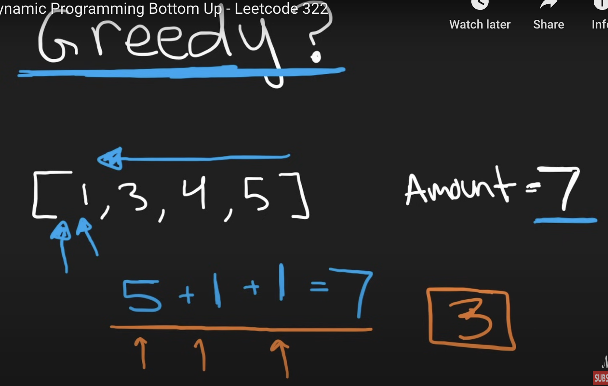
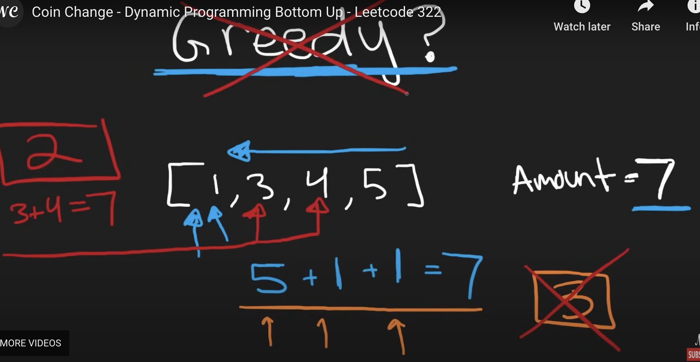
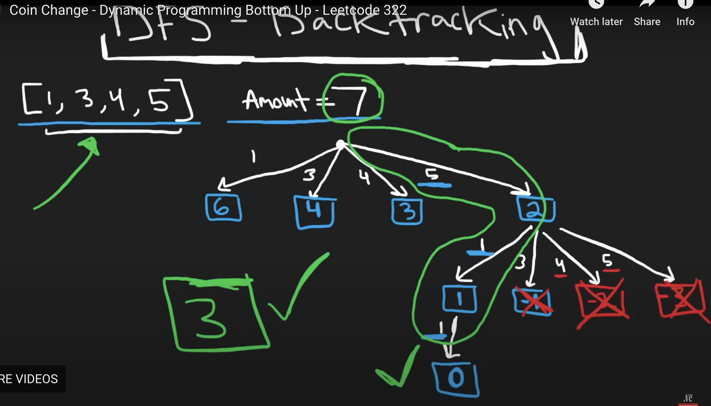
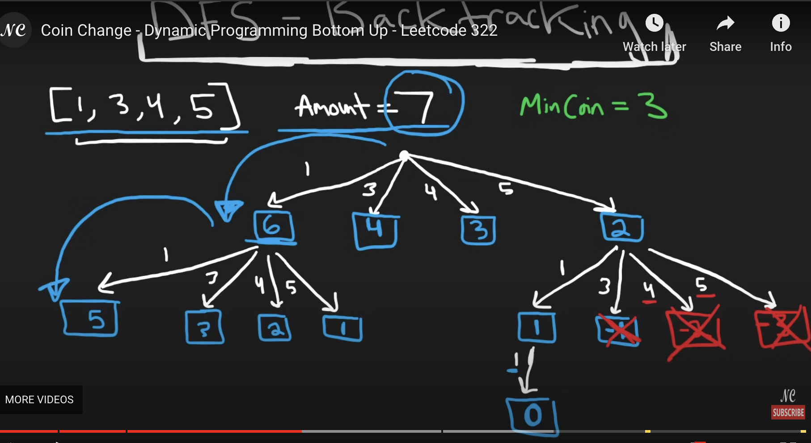
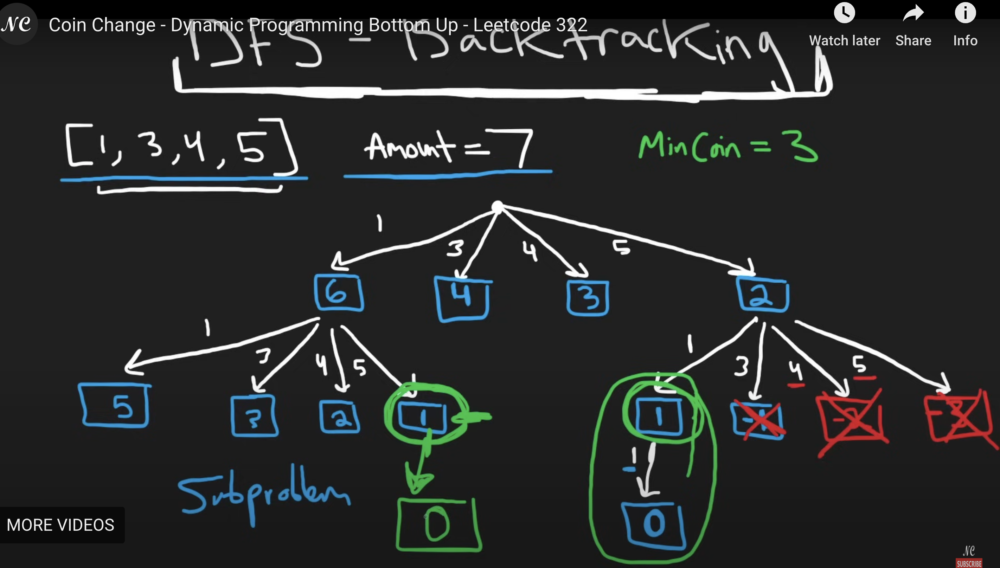
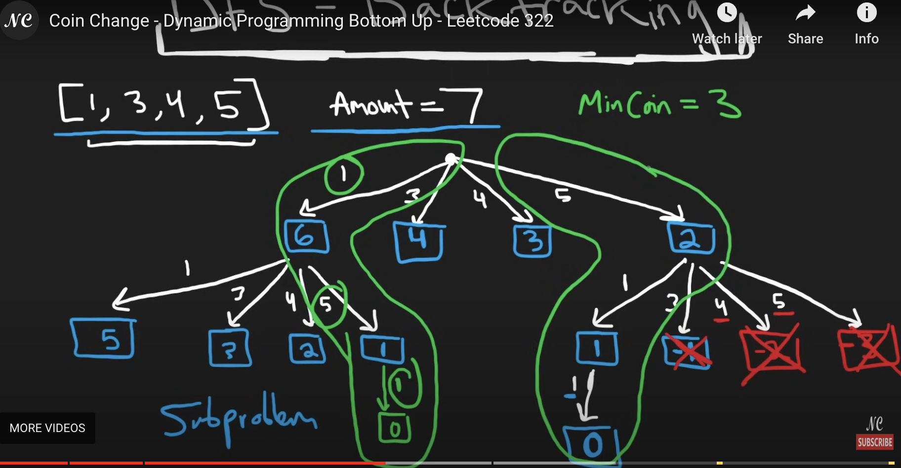
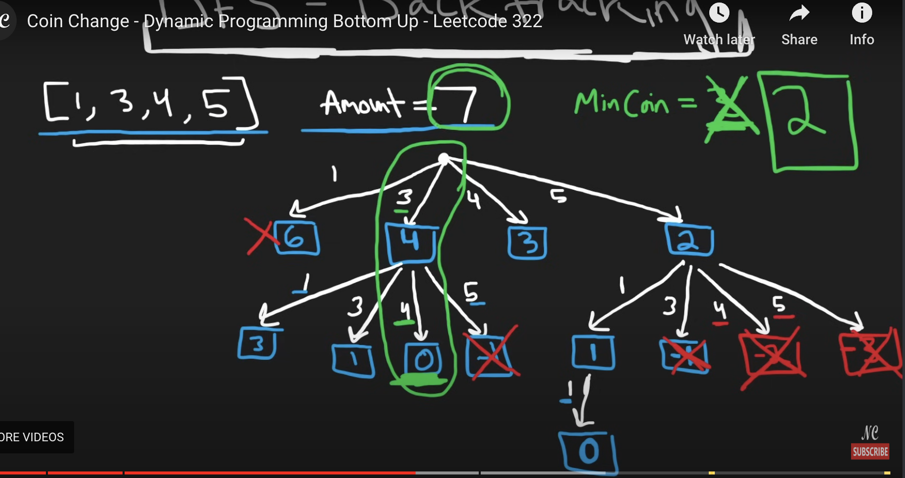
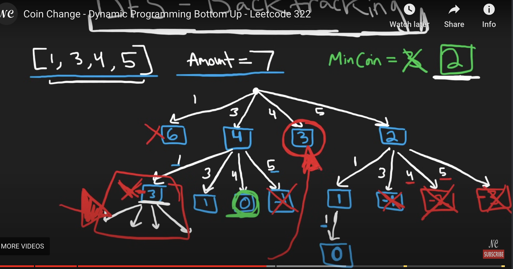
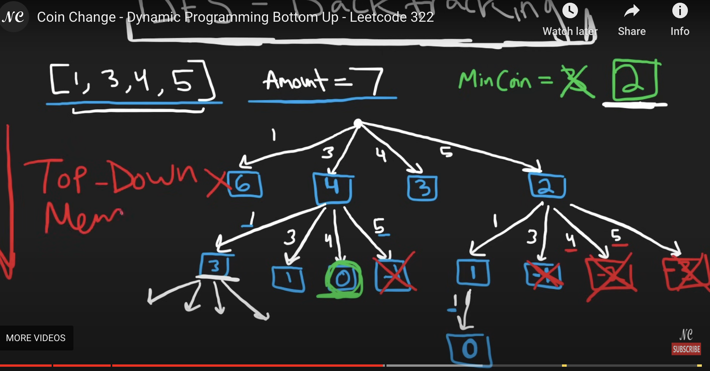
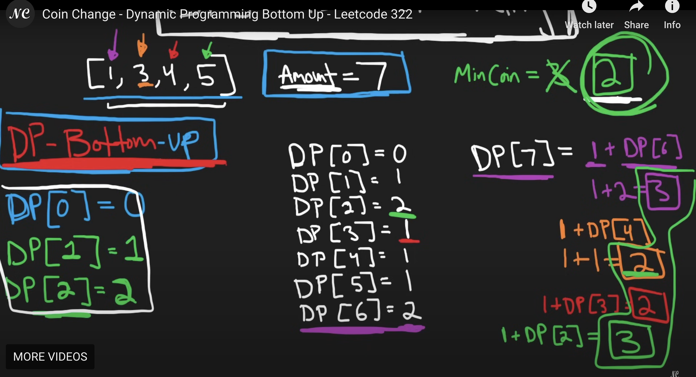

```python
class Solution(object):
    def coinChange(self, coins, amount):
        """
        :type coins: List[int]
        :type amount: int
        :rtype: int
        """
        # dp[i]: minimum number of coins that sum to amount i
        dp = [amount+1] * (amount+1) # 0...amount
        dp[0] = 0
        for a in range(1, amount+1):
            for c in coins:
                if a - c >= 0:  # a-c is remaining amount
                    dp[a] = min(dp[a], 1 + dp[a-c]) # 1 means number of coins we choose, not the value
        return dp[amount] if dp[amount] != amount + 1 else -1
# dp[a] = 1 + dp[a-c] For [1,3,4,5] and amount is 7
# DP[7] = 1 + DP[6] = 1 + 2 = 3 # choose coin 1
# DP[7] = 1 + DP[4] = 1 + 1 = 2 # choose coin 3
# DP[7] = 1 + DP[3] = 1 + 1 = 2 # choose coin 4
# DP[7] = 1 + DP[2] = 1 + 2 = 3 # choose coin 5
```
Time complexity: O(amount+ len(coins))

Space Complexity: O(amount)

dp[i]: minimum number of coins that sum to amount i, and for dp[a] = min(dp[a], 1 + dp[a-c]): 1 means the number of coins we choose, not the coin's value.

___
___
Firstly, let's try greedy. For [1,3,4,5] and amount = 7, let's start at the biggest coin which is 5, then if we take 5 again 5+5 = 10 > 7, then try 5+4, 5+3 both not work, and then try 5+1+1 which is 7. So in this greedy approach, we went down from the biggest to smallest coin values, which is pick the biggest possible coin first. In this case, the amount of coins is 3.



But if 3 is the minimum amount of coins?  The answer is no. Because we can take 3 and 4 coin, 3+4 = 7, so the minimum amount is 2. So this is the counter example, **we cannot be greedy** if we want to solve it.




___

Next let's try brute force solution, we need to implement some depth first search or backtracking solution.
Using same problem before [1,3,4,5] and amount = 7, so what would a backtracking solution even look like for this problem?  It's gonna be brute force. Since wee have 4 coin values, it means in our decision tree we have four possible choices, we can choose 1 or 3 or 4 or 5. Then if we first choose 5, the left amount will be 7-5 = 2 which write in blue. Then when amount = 2, we can still have four possible choices, 1 or 3 or 4 or 5. If we choose 1, the left amount is 2-1 = 1, if we choose 3, the left amount is 2-3 = -1, which is negative value, and if we choose 4 or 5 will be more negative, so we will just consider choose 1 in this case, since negative value doesn't work. Next, when we choose 1, the left amount is 1-1 = 0, which is what we want, and we don't need to search anymore from here. In this path, the coins we choose is 5,1,1 so the number of coins in this path is 3. Now the mincoin we can set MinCoin = 3.



Now first chosse coin1, **remaining amount is marked in blue.** Same process like before. And we can see that how we're taking the original problem which is 7 and then breaking it down into subproblems like 6 and then breaking it down even further into 5.



And also notice these subproblems are repeating themselves. Here we have a remaining amount of 1 circled by green, and in the right we also have a remaining amout of 1. So we don't need to recompute the path in the left, since we already know if we have an amount 1 it takes only a single coin for us to be able to reduce it to the amount of 0, which is what we're looking for.



And we can see same path happened here just in different order



Then if first take 3 and then take 4, the sum is 7. Then the minimum coin we need will be updated to 2, which is MinCoin = 2.



Note if once we solved the subproblems of the remaining amount is 3, the red square part in the image, we don't need to solve the subproblems again in the right.



If we store it in memory if we have a cache or you can call it dp, we don't need to repeat these subproblems. So the way I just solved this was called  top down memorization because we are doing it recursively.


___
🌟🌟🌟🌟🌟**But we can actually solve it as a true dynamic programming solution, which is  bottome up. It means basically instead of solving the original problem where the amount is 7, we solve it in reverse order. We start at the smallest one which is amout is 0, and we wanna know for amount equals 0, what's the minimum number of coins for us to sum to 0?**  We can call it DP[0]. And we know it takes zero coins. So DP[0] = 0.

🌟🌟🌟🌟🌟 Then what's the minimum number of coins for summing to 1? DP[1] = 1, since in [1,3,4,5], we could only take value 1 coin to sum to 1. Then we can just repeat this process. Then how many coins does it take for us to sum to 2? DP[2] = 1 + DP[1] = 2 since we got 4 coins, but value 3,4,5 coins will going to be too big. Then keep repeating the process for all amounts starting at 0 to 7.

Now this is the DP value calculated so far:
```css
DP[0] = 0
DP[1] = 1
DP[2] = 2
DP[3] = 1
DP[4] = 1
DP[5] = 1
DP[6] = 2
```
🌟🌟🌟🌟🌟 Then let's get DP[7]. We still have to check every single coin in [1,3,4,5]. If we get coin1, then **we take the result of 1, which means how many coins we use, not the value 1**, because we need one coin with a value 1, now we have a remaining amount of 6. DP[7] = **1**+ DP[6] = 1 + 2 = 3 in this case.

If we use the coin value 3, then it takes us one coin and the remaining value is 4, so DP[7] = 1 + DP[4] = 1 + 1 = 2

If we use the coin value 4, then it takes us one coin and the remaining value is 3, so DP[7] = 1 + DP[3] = 1 + 1 = 2

If we use the coin value 5, then it takes us one coin and the remaining value is 2, so DP[7] = 1 + DP[2] = 1 + 2 = 3

From these four values: DP[7] = 1 + DP[6] = 1 + 2 = 3, DP[7] = 1 + DP[4] = 1 + 1 = 2, DP[7] = 1 + DP[3] = 1 + 1 = 2, DP[7] = 1 + DP[2] = 1 + 2 = 3, we want to take the minimum which is 2. So we can return MinCoin = 2 finally.



___

For dp array it is length of amount + 1, since we are going from zero to amount. And the default value in this array is amount + 1, or can set it to inifinity.
```python
dp = [amount+1] * (amount+1) # 0...amount
```
The base case is dp[0] meaning if want to calculate amount 0, then it only takes 0 coins.
```python
dp[0] = 0
```
We're gonna solve it in bottom up solution, from amount 1 to the target amount.
```python
class Solution(object):
    def coinChange(self, coins, amount):
        """
        :type coins: List[int]
        :type amount: int
        :rtype: int
        """
        # dp[i]: minimum number of coins that sum to amount i
        dp = [amount+1] * (amount+1) # 0...amount
        dp[0] = 0
        for a in range(1, amount+1):
            for c in coins:
                if a - c >= 0:  # a-c is remaining amount
                    dp[a] = min(dp[a], 1 + dp[a-c]) # 1 means number of coins we choose, not the value
        return dp[amount] if dp[amount] != amount + 1 else -1
# dp[a] = 1 + dp[a-c] For [1,3,4,5] and amount is 7
# DP[7] = 1 + DP[6] = 1 + 2 = 3 # choose coin 1
# DP[7] = 1 + DP[4] = 1 + 1 = 2 # choose coin 3
# DP[7] = 1 + DP[3] = 1 + 1 = 2 # choose coin 4
# DP[7] = 1 + DP[2] = 1 + 2 = 3 # choose coin 5
```
Time complexity: O(amount+ len(coins))
Space Complexity: O(amount)
___
🌟🌟🌟🌟🌟A **recurrence relation** is neither inherently recursive nor iterative—it is a mathematical concept that defines a sequence based on its previous terms.
___
___
