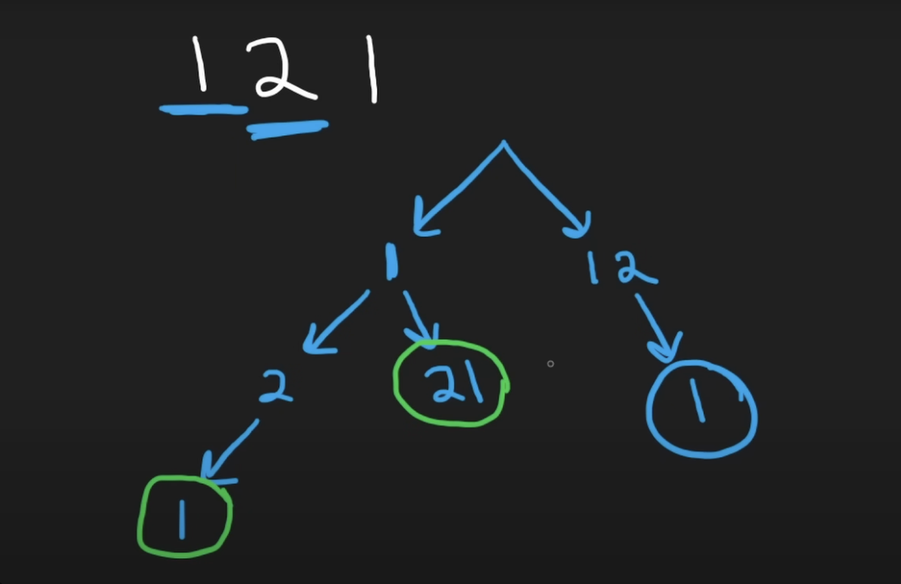
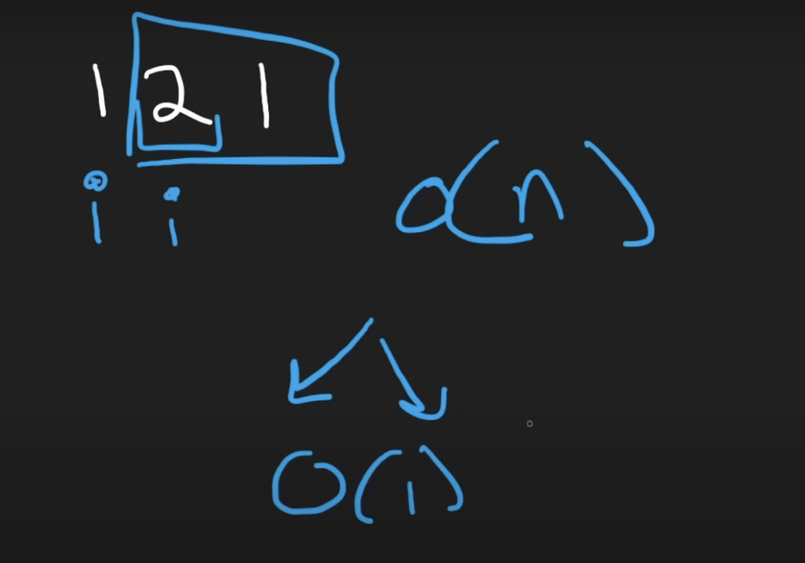

```python
class Solution(object):
    def numDecodings(self, s):
        """
        :type s: str
        :rtype: int
        """
        dp = {len(s): 1}
        for i in range(len(s) - 1, -1, -1):
            if s[i] == "0":
                dp[i] = 0
            else:
                dp[i] = dp[i + 1]
                
            if i + 1 < len(s) and (s[i] == "1" or
               s[i] == "2" and s[i + 1] in "0123456"):
                dp[i] += dp[i + 2]
        return dp[0]
```
-   **Time Complexity:** $O(n)$
-   **Space Complexity:** $O(n)$
___
___
For brute force solution, will use decision tree to illustrate it. And there's going to be a few different edge cases we have to worry about. For example, we could have a string like "06" and the string starting with 0 will be invalid, so we have to return 0 since in this case which cannot be decoded in anyway.

Try brute force approach first, and in doing that try to figure out some of the edge cases that we're gonna have to deal with.

For string "121", how many different ways can this be decoded? Let's say we start at the beginning, we could take "1" itself, which going to be some character, or we could also take the first two characters by themselves "12". **If it is "021", which starts at 0, we need to stop immediately, because we can't start with a string starting at 0. And basically any interger by itself like 1,2,3,4,5,6,7,8,9 except 0 can be taken.** So we can create any string from 1-9. And note that if the string is "127" then from 1, we cannot do to branch "27", since it is out of the range 1-26. **We can only take double digit values if the first digits starts with 1(because for the second digits can be any from 0-9, since it is 10-19) or if the first digits starts with 2 and second digits need to between 0-6(since it is 20-26).** If the first digit starts with 3 or 4 or 5, it will not work since it will not be <= 26. So we're only gonna have two branches if our first digit is a 1 or if it is a 2 and second digit in valid range. See the entire decision tree in the following graph, we have 3 different ways to decode the string.




For brute force solution, since we could have two decision at every single position(node), then our time complexity would be $2^n$, where n is the length of the input string.
___
Let's do better!  Notice the subproblem we are doing. For example for "121", when we take just 1 by itself and consider this is just one way that we decode it, then we're asking the subproblem how many different ways can we decode the remaining of the string which is "21"?  When we take the first two characters "12", then we are asking the subproblem: how many different ways can we decode the string "1"?

The dimension of our cache is n,  and that's also the time complexity O(n) since every time we get to a position i and at most we have two different decisions to make: select only first digit or select first and second digit, so that's going to be O(1) operation for making those two decisions in each position. In this case, the space complexity and time complexity are both O(n).


___
Improve space complexity: 

For "121", it could be "1" + subproblem "21" result or "12" + subproblem "1" result. So 
$$dp[i] = dp[i+1]+ dp[i+2]$$
When we have our dp cache, we don't need a full array to solve this problem, we could do it with just two variables like house robber problem, which can make space complexity to O(1).
___

First solution is recursive caching solution:
```python
class Solution(object):
    def numDecodings(self, s):
        """
        :type s: str
        :rtype: int
        """
        dp = {len(s): 1}
        def dfs(i):
            if i in dp:
                return dp[i]
            if s[i] == "0":
                return 0
            res = dfs(i+1)
            
            if i + 1 < len(s) and (s[i] == "1" or
               s[i] == "2" and s[i + 1] in "0123456"):
                res += dfs(i+2)
            dp[i] = res
            return res
        return dfs(0)
```

Time complexity: O(n)
Space complexity: O(n)

dp = {len(s):1} the entire length of the string is going to map to 1 because if we get an empty string we want to return 1. This is our good base case.

The recursive function is called dfs, dfs(i) and i is the position in string s. **Now one base case is if i in dp( it already be cached) or i is end of the string len(s) we just return dp[i]. Another base case is if the character is starting with 0, s[i] == "0", then its invalid we need to return 0. **

res = dfs(i+1) means just take first digit

If could take double digit character, then res+=dfs(i+2)

Second solution is dynamic programming solution:
```python
class Solution(object):
    def numDecodings(self, s):
        """
        :type s: str
        :rtype: int
        """
        dp = {len(s): 1}
        for i in range(len(s) - 1, -1, -1):
            if s[i] == "0":
                dp[i] = 0
            else:
                dp[i] = dp[i + 1]
                
            if i + 1 < len(s) and (s[i] == "1" or
               s[i] == "2" and s[i + 1] in "0123456"):
                dp[i] += dp[i + 2]
        return dp[0]
```
___
___
