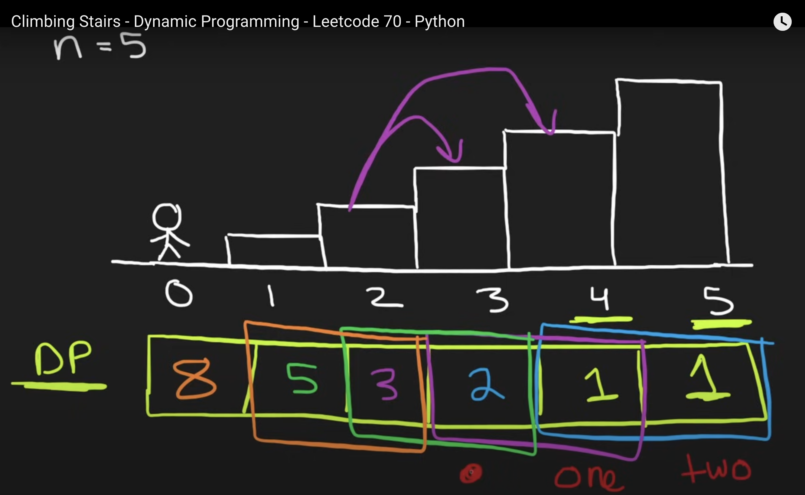

# Heap/Priority Queue
Since python doesn't have maxheap, so we convert the numbers to negative value:
```python
maxHeap = [-cnt for cnt in count.values()]
heapq.heapify(maxHeap)
```

# Tree
1. In a tree problem, consider the base case where the root node doesn't exist.
2. Consider the tree's depth to see how the problem relates to its depth."


BFS Template
102. Binary Tree Level Order Traversal: 
https://leetcode.com/problems/binary-tree-level-order-traversal/description/
```python
# Definition for a binary tree node.
# class TreeNode(object):
#     def __init__(self, val=0, left=None, right=None):
#         self.val = val
#         self.left = left
#         self.right = right
class Solution(object):
    def levelOrder(self, root):
        """
        :type root: TreeNode
        :rtype: List[List[int]]
        """
        if not root:
            return []
        q = deque()
        q.append(root)
        res = []
        while q:
            tmp = []
            for i in range(len(q)):
                node = q.popleft()
                tmp.append(node.val)
                if node.left:
                    q.append(node.left)
                if node.right:
                    q.append(node.right)
            res.append(tmp)
        return res 
```

# Graph

BFS Template: https://leetcode.com/problems/rotting-oranges/description/
```python
class Solution(object):
    def orangesRotting(self, grid):
        """
        :type grid: List[List[int]]
        :rtype: int
        """
      
        q = collections.deque()
        fresh = 0
        time = 0

        for r in range(len(grid)):
            for c in range(len(grid[0])):
                if grid[r][c] == 1:
                    fresh += 1
                if grid[r][c] == 2:
                    q.append((r, c))

        directions = [[0, 1], [0, -1], [1, 0], [-1, 0]]
        while fresh > 0 and q:
            length = len(q)
            for i in range(length):
                r, c = q.popleft()

                for dr, dc in directions:
                    row, col = r + dr, c + dc
                    # if in bounds and nonrotten, make rotten
                    # and add to q
                    if (
                        row in range(len(grid))
                        and col in range(len(grid[0]))
                        and grid[row][col] == 1
                    ):
                        grid[row][col] = 2
                        q.append((row, col))
                        fresh -= 1
            time += 1
        return time if fresh == 0 else -1
```
DFS Template: https://leetcode.com/problems/max-area-of-island/description/
```python
class Solution(object):
    def maxAreaOfIsland(self, grid):
        """
        :type grid: List[List[int]]
        :rtype: int
        """
        area = 0
        row = len(grid)
        col = len(grid[0])
        visit = set()
        def dfs(r,c):
            if (r,c) in visit or r not in range(row) or c not in range(col) or grid[r][c] == 0:
                return 0
            visit.add((r,c))
            directions = [[0,-1],[0,1],[-1,0],[1,0]]
            area = 1
            for dr, dc in directions:
                area += dfs(r+dr, c+dc)
            return area
        for r in range(row):
            for c in range(col):
                if grid[r][c] == 1 and (r,c) not in visit:
                    area = max(area,dfs(r,c))
        return area

```
Directed Graph Template: [https://leetcode.com/problems/course-schedule-ii/](https://leetcode.com/problems/course-schedule-ii/description/)
```
class Solution:
    def findOrder(self, numCourses, prerequisites):
        preMap = {i: [] for i in range(numCourses)}
        for crs, pre in prerequisites:
            preMap[crs].append(pre)

        output = []
        visited, cycle = set(), set()

        def dfs(crs):
            if crs in cycle:
                return False
            if crs in visited:
                return True

            cycle.add(crs)
            for pre in preMap[crs]:
                if not dfs(pre):
                    return False
            cycle.remove(crs)
            visited.add(crs)
            output.append(crs)
            return True

        for c in range(numCourses):
            if not dfs(c):
                return []
        return output
```
Undirected Graph Template: https://leetcode.com/problems/graph-valid-tree/description/

```python
class Solution(object):
    def validTree(self, n, edges):
        """
        :type n: int
        :type edges: List[List[int]]
        :rtype: bool
        """
        if not n:
            return True
        adj = {i: [] for i in range(n)}
        for n1, n2 in edges:
            adj[n1].append(n2)
            adj[n2].append(n1)

        visit = set()

        def dfs(i, prev):
           
            if i in visit:
                return False

            visit.add(i)
            for j in adj[i]:
                if j == prev:
                    continue
                if not dfs(j, i):
                    return False
            return True

        return dfs(0, -1) and n == len(visit)
```

Union Find Template: https://leetcode.com/problems/redundant-connection/description/

```python
class Solution(object):
    def findRedundantConnection(self, edges):
        """
        :type edges: List[List[int]]
        :rtype: List[int]
        """
        par = [i for i in range(len(edges) + 1)]
        rank = [1] * (len(edges) + 1)

        def find(n):
            p = par[n]
            while p != par[p]:
                par[p] = par[par[p]]
                p = par[p]
            return p

        # return False if already unioned
        def union(n1, n2):
            p1, p2 = find(n1), find(n2)

            if p1 == p2:
                return False
            if rank[p1] > rank[p2]:
                par[p2] = p1
                rank[p1] += rank[p2]
            else:
                par[p1] = p2
                rank[p2] += rank[p1]
            return True

        for n1, n2 in edges:
            if not union(n1, n2):
                return [n1, n2]
```
# Backtracking

1. Note using copy like nums[:], subset[:]

Combination Sum II template: https://leetcode.com/problems/combination-sum-ii/description/
```python
class Solution(object):
    def combinationSum2(self, candidates, target):
        """
        :type candidates: List[int]
        :type target: int
        :rtype: List[List[int]]
        """
        candidates.sort()
        res = []
        subset = []
        def dfs(i, val):
            if val == target:
                res.append(subset[:])
                return 
            if i >= len(candidates) or val > target:
                return 
            subset.append(candidates[i])
            val+=candidates[i]
            dfs(i+1, val)
            subset.pop()
            while i + 1 <= len(candidates) -1 and candidates[i] == candidates[i+1]:
                i+=1
            val -=candidates[i]
            dfs(i+1,val)
        dfs(0,0)
        return res
```
   
Permutation Template: https://leetcode.com/problems/permutations/description/
```python
class Solution(object):
    def permute(self, nums):
        """
        :type nums: List[int]
        :rtype: List[List[int]]
        """
        res = []
        if len(nums) == 1:
            return [nums[:]]
        for i in range(len(nums)):
            n = nums.pop(0)
            perms = self.permute(nums)
            for perm in perms:
                perm.append(n)
            res.extend(perms)
            nums.append(n)
        return res
```
# Dynamic Programming



1. Bottome Up solution: https://leetcode.com/problems/climbing-stairs/description/
   
```python
class Solution(object):
    def climbStairs(self, n):
        one = 1
        two = 1
        for i in range(n-1):
            temp = two
            two = one + two
            one = temp
        return two
```

