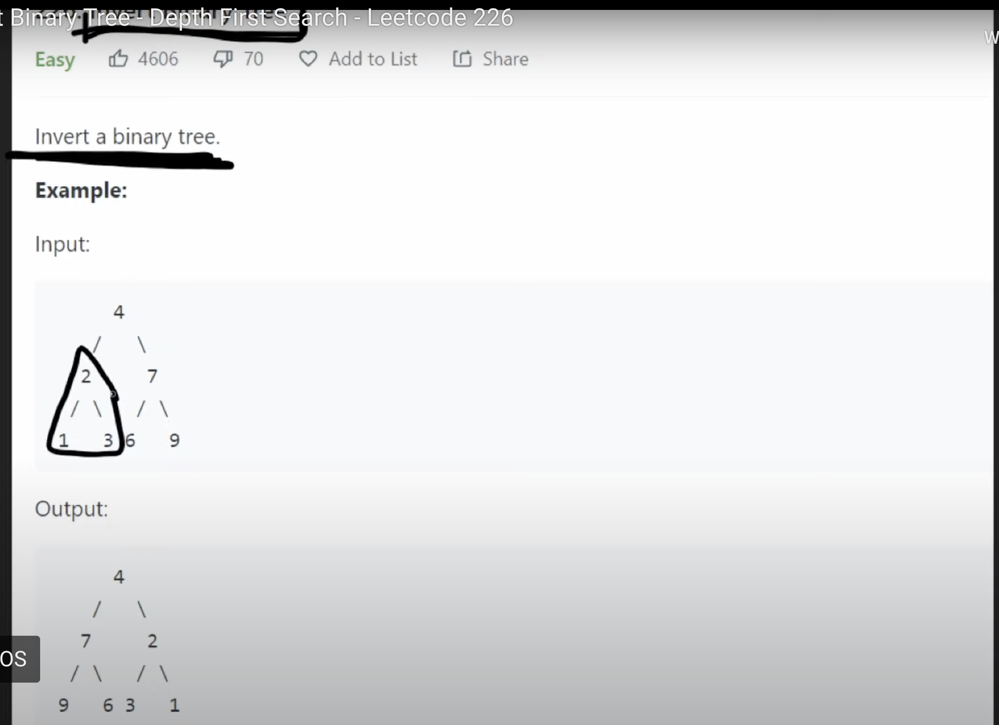
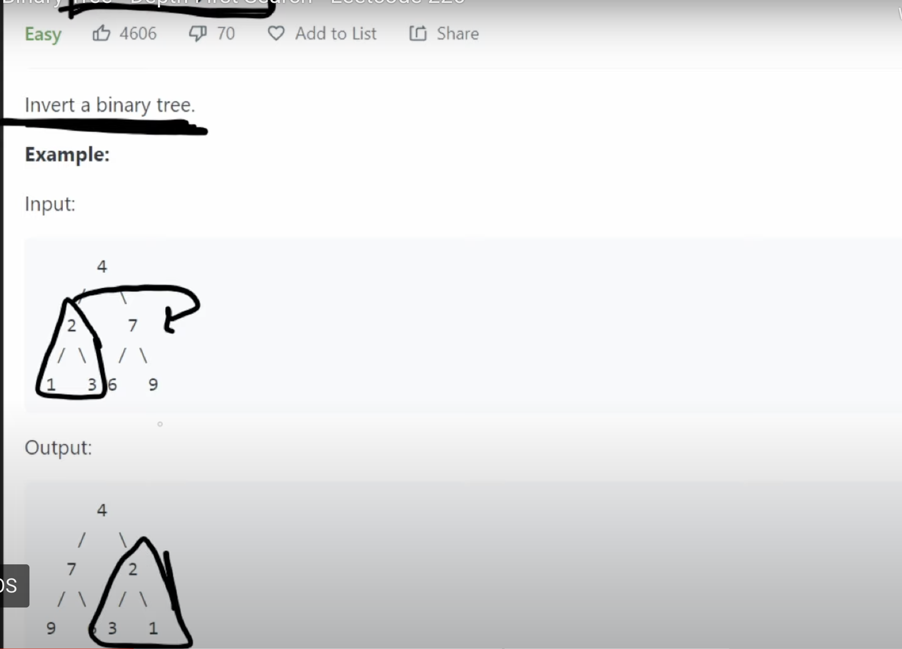
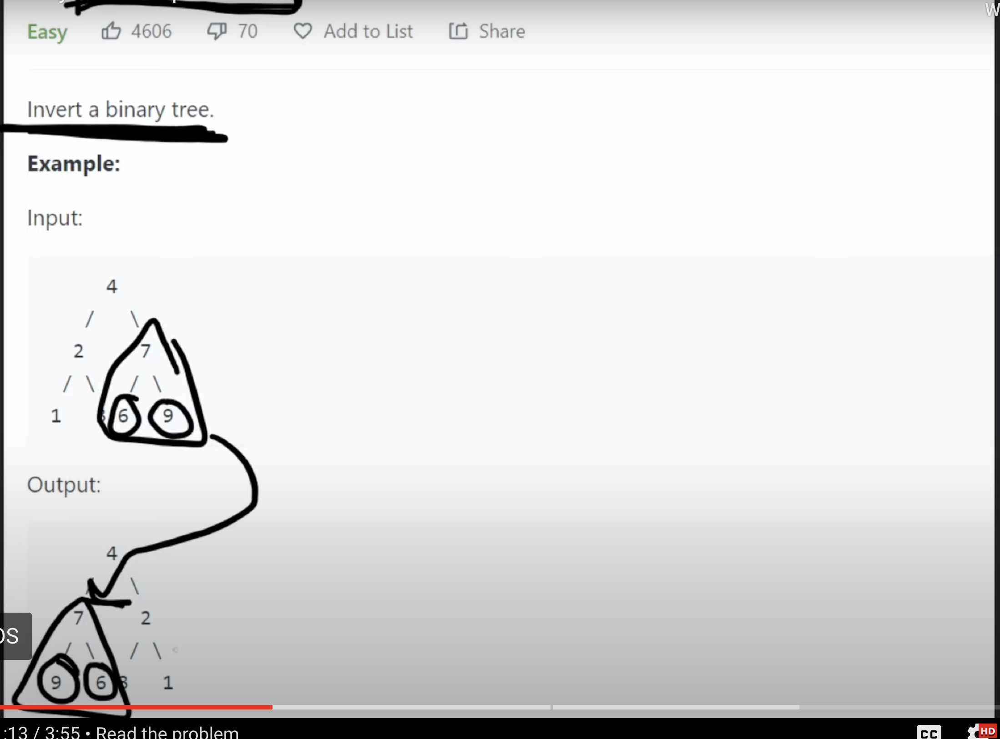

```python
# Definition for a binary tree node.
# class TreeNode(object):
#     def __init__(self, val=0, left=None, right=None):
#         self.val = val
#         self.left = left
#         self.right = right
class Solution(object):
    def invertTree(self, root):
        """
        :type root: Optional[TreeNode]
        :rtype: Optional[TreeNode]
        """
        if not root:
            return None
        # swap the children
        tmp = root.left
        root.left = root.right
        root.right = tmp
        self.invertTree(root.left) 
        self.invertTree(root.right)
        return root
```

-   **Time Complexity**: **O(n)** (each node is visited once).
-   **Space Complexity**: **O(h)** (call stack depth is equal to the tree height):
    -   **O(n)** in the worst case (skewed tree).
    -   **O(log n)** in the best case (balanced tree).

> Time Complexity: O(n) Each node is visited **once** during the traversal. Since there are n nodes and each node does O(1) work for the swap, the **total work is proportional to n**.

___
___
Explanation:

Invert the binary tree it's a **recursive** definition. So take a took at this subtree.



 Since we moved it to this side, that's where it is. But notice that the subtree are different now. 1 was initially on the left and 3 on the right, but now 3 is on the left and 1 is on the right.
 


The exact same thing happened with this tree. It was moved to the left side, but it's chidren were also swapped.



🌟🌟🌟🌟🌟 So invert binary tree means visit every single node in the tree and every time we visit a node, take a look at its two children and swap  the positions of the children. So in other words, if we're given a tree, look at the root node and take it's chidren and then swap the positions and then recursively run invert on the left subtree and run invert on the right subtree. So it's a recursive definiton.

🌟🌟🌟🌟🌟  So we can solve this problem with recursion **we can do a Depth first search DFS** whether it's preorder or postorder it doesn't actually matter. **A DFS allow us to solve this problem recursively.**
___
We can first check the base case, if the root is null then we can return null, we don't have to continue. 

```python
if not root:
	return None
```

Otherwise, we're going to swap the children.

```python
# swap the children
tmp = root.left
root.left = root.right
root.right = tmp
```
After we swap the nodes, all we have to do is now recursively invert the subtrees. So we can invert the left subtree and then we can invert the right subtree. By doing self.inverttree, what we're doing is making a recursive call to the function we're inside and once we have swapped the root's children. Once we have inverted the left subtree and inverted the right subtree, we're finished then we can just return root.
```python
# Definition for a binary tree node.
# class TreeNode(object):
#     def __init__(self, val=0, left=None, right=None):
#         self.val = val
#         self.left = left
#         self.right = right
class Solution(object):
    def invertTree(self, root):
        """
        :type root: Optional[TreeNode]
        :rtype: Optional[TreeNode]
        """
        if not root:
            return None
        # swap the children
        tmp = root.left
        root.left = root.right
        root.right = tmp
        self.invertTree(root.left) 
        self.invertTree(root.right)
        return root
```

-   **Time Complexity**: **O(n)** (each node is visited once).
-   **Space Complexity**: **O(h)** (call stack depth is equal to the tree height):
    -   **O(n)** in the worst case (skewed tree).
    -   **O(log n)** in the best case (balanced tree).

> Time Complexity: O(n) Each node is visited **once** during the traversal. Since there are n nodes and each node does O(1) work for the swap, the **total work is proportional to n**.

___
___
