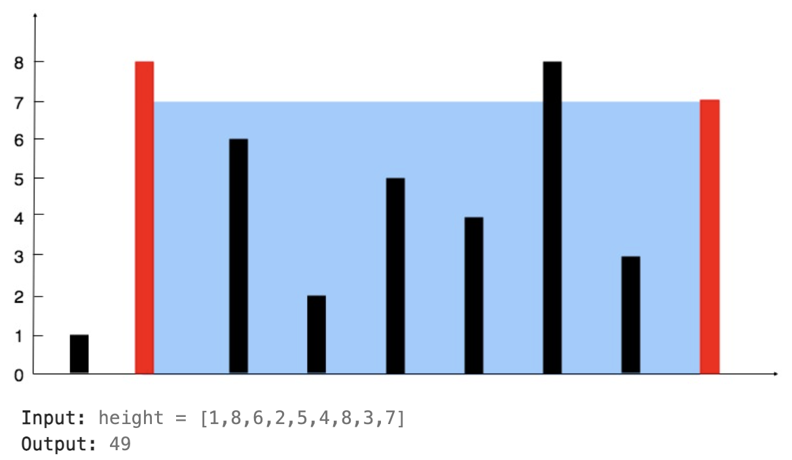

# Intuition

This problem can be approached by visualizing a graph, making it easier to understand and solve.



This problem can be simplified by visualizing it graphically. We can solve it using a two-pointer technique. Initially, the left pointer is set at the start of the array, and the right pointer is set at the end of the array. The goal is to find the largest possible area, which is constrained by the shorter of the two heights pointed to by the pointers. The area can be calculated as `min(height[left], height[right]) * (right - left)`. The height of the container is limited by the shorter of the two heights.

To maximize the area, we should move the pointer that points to the shorter height. This is because moving the pointer with the taller height will not help in finding a larger area, as the height of the container will still be limited by the shorter height. Specifically, the new height will be `min(height[left], height[new_right])`, which will be less than or equal to the previous shorter height, and the interval distance will shrink. Therefore, if the left pointer points to the shorter height, we move it to the right. Conversely, if the right pointer points to the shorter height, we move it to the left.

# Approach

1. Initialize two pointers: left at the start of the array and right at the end of the array.
2. Initialize a variable `res` to store the maximum area.
3. Use the formula `res = max(res, min(height[left], height[right]) * (right - left))` to calculate the area and update `res`.
4. Move the pointer pointing to the shorter height to try to find a larger area.
5. Set an early stop condition: let `h` be the maximum height in the array. If `(right - left) * h` is less than `res`, it means it is impossible to find a larger area, so we can break the loop.

# Complexity
- Time complexity:
  $$O(n)$$
  - We only pass through the array once with two pointers, making the time complexity linear.
- Space complexity:
  $$O(1)$$
  - We only use a constant amount of extra space regardless of the input size.
# Code
```
class Solution(object):
    def maxArea(self, height):
        """
        :type height: List[int]
        :rtype: int
        """
        l = 0
        r = len(height) -1
        h = max(height)
        res = 0
        while l < r:
            if (r-l) * h <= res:
                break
            res = max(res, min(height[l],height[r]) * (r-l))
            if height[l] <= height[r]:
                l+=1
            elif height[l] > height[r]:
                r-=1
        return res  
```
