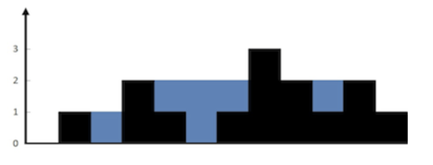

# Link:
- [42-Trapping-Rain-Water](https://leetcode.com/problems/trapping-rain-water/description/)

# Intuition

This problem can be approached by visualizing a graph, making it easier to understand and solve.

Given an input: `height = [0,1,0,2,1,0,1,3,2,1,2,1]`, the output should be `6`.

**Explanation**: The elevation map represented by the array `[0,1,0,2,1,0,1,3,2,1,2,1]` results in `6` units of trapped rainwater.



Initially, I attempted to move the left and right pointers together, but encountered issues when reaching the half-right part `[3,2,1,2,1]`. At this point, the left pointer points to the value `3`, and the right pointer points to the end of the array. The right boundary is incorrect since it is less than the left boundary, preventing rainwater from being trapped.

Here's the incorrect solution:

```python
class Solution(object):
    def trap(self, height):
        """
        :type height: List[int]
        :rtype: int
        """
        l = 0 
        r = 1
        area = 0
        while l < r and r < len(height)-1 :
            while height[r] < height[l] and r < len(height)-1 :
                r+=1
            for i in range(l+1,r):
                area+=height[l] -height[i]
            l = r
            r = l +1
        return area
```

Then, I watched NeetCode, which initializes the left and right pointers to the start and end positions of the array, respectively. Additionally, it uses two variables, `leftmax` and `rightmax`. Each time, the smaller value is moved, and the area is summed up. If `rightmax` is smaller, it moves to the left since it cannot trap rainwater from the left pointer and adds the current area value `rightmax - height[r]`. Conversely, if `leftmax` is smaller, it adds the area value `leftmax - height[l]` and moves to the right to check the next value.

# Approach
- Initialize two pointers, `left` and `right`, at the start and end of the array, respectively.
- Initialize `leftmax` and `rightmax` to the start and end positions.
- Move the smaller value and update the max value and sum up area to final result.
# Complexity
- Time complexity:
  $$O(n)$$
  - We traverse the array once, making the time complexity linear.

- Space complexity:
  $$O(1)$$
    - We use a constant amount of extra space regardless of the input size.

# Code
```
class Solution(object):
    def trap(self, height):
        """
        :type height: List[int]
        :rtype: int
        """
        l = 0
        r = len(height)-1
        leftmax = height[l]
        rightmax = height[r]
        res = 0
        while l < r:
            if leftmax < rightmax:
                l+=1
                leftmax = max(leftmax, height[l])
                res += leftmax - height[l]
            else:
                r-=1
                rightmax = max(rightmax, height[r])
                res += rightmax - height[r]
        return res
```
